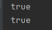
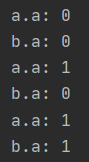
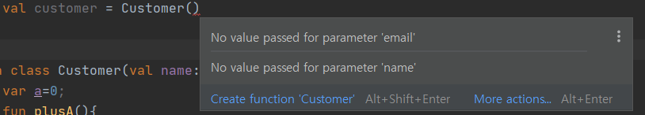

# Kotlin Day02

## Idioms - 관용구

* 자주 사용하는 코딩 형태로 같은 결과를 내는 프로그램을 다른 모양으로 작성할 수 있는데, 관용구는 주로 사용되는 형태를 말한다. 
* 여기에는 Kotlin에서 자주 사용되어지는 관용구(idioms)를 무작위로 모아둔 내용이다.

## DTO 만들때 (POJOs/POCOs)

* `data` 작성.

  ```kotlin
  data class Customer(val name: String, val email: String)
  ```

* data 를 붙여주면 아래 매서드들이 자동으로 생성해 준다. (DTO)

  * getters (and setters in case of *var*s) for all properties
  * `equals()`
  * `hashCode()`
  * `toString()`
  * `copy()`
  * `component1()`, `component2()`, …, for all properties (see [Data classes](https://kotlinlang.org/docs/reference/data-classes.html))

* 여기서 의문점이 든것이 DTO의 의미였다.

* 다음 코드를 실행

  ```kotlin
  class Custommer (val name: String, val email: String)
  fun main(){
      var a = Customer("aa","aa@aa.aa")
      var b = Customer("aa","aa@aa.aa")
      println(a==b)
      println(a.equals(b))
  }
  ```

  * 위의 코드를 실행하면 둘은 객체의 내용은 갖지만, 각각 서로 메모리를 할당하여 객체를 생성하였으므로 결과는 아래와 같이 나온다.

  

  * 그러나 이를 DTO 형태로 만들어 준다면

    ```kotlin
    data class Custommer (val name: String, val email: String)
    fun main(){
        var a = Customer("aa","aa@aa.aa")
        var b = Customer("aa","aa@aa.aa")
        println(a==b)
        println(a.equals(b))
    }
    ```

    

  * 두 객체가 같은 객체가된다.

  * 그래서 나는 이게 Singleton 패턴을 이용하여 같은 객체로 받는줄 알고 아래와 같이 코드를 수행해 보았다.

    ```kotlin
    data class Customer(val name: String, val email: String){
        var a=0;
        fun plusA(){
            a++
        }
    }
    
    fun main(){
        var a = Customer("a", "b")
        var b = Customer("a", "b")
    
        println("a.a: "+a.a)
        println("b.a: "+b.a)
        a.plusA()
        println("a.a: "+a.a)
        println("b.a: "+b.a)
        b.plusA()
        println("a.a: "+a.a)
        println("b.a: "+b.a)
    }
    ```

  * 만일 싱글톤 객체라면 plusA() 매서드를 실행할 때마다 두객체 모두 `.a`가 1씩 증가해야 한다. 하지만 결과는

    

  * 결국 싱글톤은 아니라는 것! 하지만 객체타입은 같다. 이정도로 기억하면 될듯하다.

## 함수 매개변수를 Default로 지정

* 함수의 매개변수를 지정할때 대입연산자`=`를 통해 값을 직접 넣어준다면 default값으로 지정할 수 있다.

  ```kotlin
  fun foo(a:Int = 0,b:String=""){...}
  ```

* 매개변수의 Default 값을 정해주면 객체 생성시 기본생성자로 생성할 수 있다. (없으면 기본생성자 사용 불가능!)

  ```kotlin
  class Customer(val name: String="", val email: String=""){}
  
  fun main(){
  	val customer = Customer() // 생성가능
  }
  ```

* default값이 없으면 불가능하다.

  ```kotlin
  class Customer(val name: String, val email: String){}
  
  fun main(){
  	val customer = Customer() // 생성가능
  }
  ```

  

  

## Filtering a list


