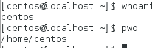

# 2020-02-19

## 1) Linux day2

### 디렉토리


### root와 유저

* whoami 명령어 : 현재 접속중인 사용자 이름 확인



* 터미널에서 다른 접속자로 이동.

  * su 명령어(User Change)

  
  * 원래는 암호가 필요하나 root는 모든 계정 위에있어 암호 필요없이 접속가능.
  * exit : 접속한 유저 로그아웃

  

  * 계정확인
  
  
  
  * /etc/passwd 에디터 실행
  
  
  
  * 아랫쪽에 centos 사용자 있음 나머지는 리눅스에 내장된 사용자들.
  
  
  
  * 계정의 암호 확인
  
    
  
  
  
  * !! : 암호없이 생성된 계정.
  * 암호가 있는 계정은 encoding되어 작성되어있다.
  * 그룹확인
  
  
  
  ​	
  
  * 사용자그룹 / 사용자명
  
    * root  /  root (기본적으로는 사용자명과 같은 그룹으로 만들어짐)
    * centos  / centos
    * 이런식도 가능 root  /  user1 , centos  /  user2
    * 그룹에 따라 권한부여 가능하다.(복수개의 사용자에게 동시에 적용가능.)
  
  * 사용자 생성 / 그룹 변경 ---> `root` 계정만 사용가능.
  
  * 유저추가(useradd 유저명)
  
    
  
    * 현재는 암호가 없는 상태.
    * 이상태로는 gedit 불가능
  
    
  
    * root계정만 볼수있는 경우
  
    
  
  
  
  * 암호부여 (passwd 유저명)
  
    
  
    * 유저설정 변경(usermod)
  
      * 그룹변경
  
        ​				
  
      * gedit /etc/passwd 에서 확인
  
      
  
      * 1001뒤에 0이 root그룹을 의미함.
  
    * 유저삭제 (userdel)
  
      * userdel testuser1 --> 사용자삭제(디렉토리는 남아있음)
      * 디렉토리 남은상태에서 다시 useradd testuser1 입력해도 만들어 지지 않음(디렉토리가 남아있기 떄문이다.)
      * userdel -r testuser1 --> -r 넣었을때 디렉토리도 지워짐.
      * 또한 위 상황에서 userdel을 사용했을때 testuser1의 변경전 그룹이었던 testuser1 group이 아직 남아있어 나중에 사용자 생성시에 오류가 생김.
  
    * 그룹도 마찬가지 (groupadd  /  groudmod  /  groupdel) 그룹만 생성, 변경, 삭제
  
  
  
  ​		 
  
  * 사용자 관리 프로그램(직접 설치해야함)
  
    * system-config-users
    * 설치를 위해 yum -y install system-config-users를 작성.
    * 설치중.
  
    
  
    * 설치 완료후 실행
  
    
  
    
  
  * 이와 같이 필요 프로그램이 있을떄 yum 명령어를 통해 다운로드후 사용이 가능하다

### 파일과 디렉토리의 소유와 허가권

* ls -l 을 통해 파일리스트 권한을 볼수 있다.


* ls -al 명령어를 통해 숨김파일(.으로 시작하는 파일)도 볼수 있다.

* 접근방법 3가지로 나눔.

  ​					현재 사용자						같은 그룹에 속한 사용자		다른그룹의 사용자


	>r:4  w:2  x:1  셋중 가능한 숫자를 더해서 이용함  (- : 0 권한없다.)
	>
	>rw : 6	rx : 5	wx : 3(이런 권한은 없다.) rwx : 7
	>
	>읽을 수 없는 파일은 쓸수도 없으므로 w는 r이 가능해야함.	

* ex


> 이 파일은 일단 첫문장이 d 이므로 디렉토리임.
>
> 첫 3글자 rwx : 현재 접속 소유자는 3개 모두 가능
>
> 다음 3글자 r-x: 소유자와 같은 그룹의 유저는 r과 x 만 가능
>
> 마지막 3글자 r-x 기타사용자는 r과 x만 가능

* chmod 000 ~ 777 파일명
  * chmod로 권한을 줌.
  * chmod 777 test : 모두 rwx 가능
  * chmod 644 test : rw ,r ,r 가능
* chown 소유 사용자 변경
  * root계정에서만 사용 가능하다.
  * chown centos test : centos 에게 소유권한을 넘김.
  * ls -l 에서 3번째 속성이 소유자.
* 사용자 그룹 변경
  * root - user 변경
  * chgroup user test : test파일의 그룹을 user그룹으로 변경.
  * chown user.centos test 도 가능. 사용자와 그룹 둘 한번에 변경 가능함.
* echo +"문자열"
  * 커맨드에 문자열 바로 출력 > or >> 명령어를 통해 저장가능.


* 생성 파일 실습 (책 197쪽)접근권한 변경

  * txt 파일 하나 생성

  

  * 파일 실행(`/`를 통해 파일 위치와 이름을 입력하면 실행하는 명령어)

  

  * 권한부여

  

### 링크

* ln 원본파일 링크이름  ==>(하드링크)
* lln -s 원본파일 링크이름 ==> symbolic (심볼릭링크)
* ls -i를 통해 i node를 확인할수 있다.


> 맨앞 숫자가 `I node` 값이다.

* 링크설정


#### 하드링크

* 하드링크는 원본을 알려주지 않는다.
* 하드링크는 원본파읽과 `I node`의 값이 같다.
* 하드링크는 원본파일과 권한이 같다.
* 원본을 수정하더라도 그 내용이 반영된다.
* 원본파일의 이름을 바꿔도 참조는 여전히 가능하다.
* 파일에 대한 링크를 지정할때 사용이 용이하다.

#### 소프트링크

* 소프트링크는 원본을 알려줌.
* 소프트링크는 `I node`값이 원본과 다르다.
* 소프트링크는 맨앞에 l로 표시되며 권한이 777로 되어있다.
* 원본을 수정하더라도 그 내용이 반영된다.
* 원본파일의 이름이 바뀌면 사용할 수 없다. 가져올 수 없다.
* 디렉토리 링크를 지정할때 사용이 용이하다.

* alias 도 link와 비슷한 개념이지만, 터미널이 종료되면 사라진다.

  

  > 원본 파일 삭제하면.. 
  >
  > 하드링크는 남아 있지만, 소프트링크는 사용을 할 수 없다.

  

### 설치파일.

1. 윈도우의 경우
   1. zip -> 압축해제 -> c:\
   2. exe -> jdk, tomcat등
2. Linux의 경우
   1. 압축파일 : zip, tar, tar.bz, tar.gz
   2. 설치파일 : rpm

#### rpm / yum

* 설치파일을 진행하는 명령어.
* rpm
  * *.rpm 파일 설치/ 삭제/ 설치정보확인에 사용함.
  * rpm -Uvh *.rpm   :   rpm파일 설치명령어
    * U : (없으면)신규 / (있으면)업그레이드
    * v : 설치 과정 출력
    * h : ########표시
  * rpm -e *   :   rpm파일 삭제명령어
  * rpm -qa *jdk*   :   설치된 rpm 파일중 jdk가 포함된 파일 찾는 명령어
    * -qip 정확한이름.rpm --> 미설치 프로그램 정보 조회

>rpm 을 통한 파일관리 설치.(책 208 page)
>
>mc-4.8.7-8.el7.x86_64.rpm
>
>* 설치
>
>
>
>* 삭제
>
>
>
>* 의존성이 있는 파일 설치.
>
>
>
>* 의존성 파일이 있을때는 rpm으로 설치가 불가능하다.


* yum

  * rpm 의 의존성 문제를 해결한 명령어
  * 의존성 파일까지 같이 설치해준다.
  * rpm은 설치파일이 미리 내 컴퓨터에 다운로드 되어 있어야 하나 yum을 이요하면 자동으로 다운로드와 설치를 진행한다.

  >
  >
  >* yum을 이용한 설치
  >
  >
  >
  >* dependency 가 존재할때
  >
  >
  >
  >* 설치 완료
  >
  >
  >
  >* 삭제
  >
  >
  >
  >* 삭제완료
  >
  >

  * yum 이 안될때.
    * 설정파일이 잘못된 경우
    * 네트워크에 문제가 있는경우.

> * rpm 과 yum의 비교
>
> | 명령어            | yum                                                   | rpm            |
> | ----------------- | ----------------------------------------------------- | -------------- |
> | 설치              | yum install                                           | rpm -Uvh *.rpm |
> | 설치파일          | gedit /etc/yum.repos.d/<br />CentOS-Base.repo 에 지정 | 갖고 있어야함  |
> | 네트워크 사용여부 | O                                                     | X              |
> | 디팬던시 파일설치 | 다 해줌.                                              | 안해줌.        |
>
> 

* yum localinstall : 사이트에 가지않고 내 컴퓨터에 있으니 바로 설치하라는 명령어

* yum clean all : yum 저장소 초기화.(뭔가 오류 있을때 한번씩 사용하기. 이전버전이 있을때 설치가 안되는 경우가 있다.)


* gedit /etc/yum.repos.d/CentOS-Base.repo

  * 사용할 저장소 url 정보 등 정보들어있다.

  

  


#### tar / unzip

* 압축파일을 해제하는 명령어

> 윈도우도 도스에서 압축이 가능함.
>
> 그러나 툴이 있어 굳이 어렵게 도스에서 할 필요가 없다..

1. 파일 압축 - 파일 1개만 압축가능.(1개씩 여러번 진행)	-	(책 227쪽)

   * 압축 종류에 따라 명령어가 다름.
     * *.gz : 많이 사용함.
     * *.bz

2. 압축 파일 묶기 

   * tar 명령어 사용.
   * tar J/z/j 를 통해 압축과 묶기 한번에 가능
     * J : xz
     * z : gzip
     * j : bzip2

   > ex) tar `cfvz` /root/*.* root.tar.gz
   >
   > `c`: 묶기 `f`:파일이름지정 `v`:진행과정 출력 `z`: `tar`+`gzip`(확장자 설정)

3. 압축풀기

   * c대신 x 입력

   >* tar `xfvz` /root/*.* root.tar.gz

### 파일 위치 찾기

* 파일의 위치를 찾는 명령어
     * which - 환경변수 등록 경로상 파일명 검색
     
     * whereis - 실행, 소스....등찾아줌. 옵션부여 x
     
     * find - 가장 강력한 기능. 종류를 안가림.
       
       * 문법 : find 경로 -옵션 조건
       * 기본적인 rpm파일들 저장된 루트 /run/media/root/CentOS 7 x86_64/Packages
       * -name : 이름으로조회( find /root -name jdk* )
       * -perm : 권한으로 조회(find /root -perm 777)
       * -user : 파일소유주로 조회(find /root -user centos)
       
>  기호연산자들.
>
>  1. find 사용시 내용이 너무 많을때.(find말고도 사용가능)
>
>     more 명령어 사용.
>
>     tail or head 도 가능.
>
>     파이프라인 연산자를 통해 find와 함께 사용가능.
>
>     ​	ex) find / -user centos | more 
>
>     ​	`|` 를 기준으로 앞쪽에 있는 명령어를 뒤쪽에 있는 명령어의 매개변수로 보내는 방법.
>
>     ​		두개의 명령어를 한번에 실행하는 방법임.
>
>  `>` , `>>` 연산자. : `redirection 연산자`
>
>  `$PATH` : PATH경로에 등록된 경로 찾아주는 연산자.
>
>  

* rpm -qa 파일명 : rpm 파일만 가능

## 2) Linux 에 JDK 설치


> 주의할점
> 1. 리눅스 설치시 openjdk1.7이 설치가 되어있음.
> 2. 지금 설치할 jdk 는 1.8버전. 따라서 1.7 지우고 설치해야함.
> 3. 새로 설치할 파일에 따라서 설치 *(rpm or tar..)
> 4. 환경변수 path 등록해야함 (java.exe & javac.exe)
> 5. hadoop을 위한 jdk 설정.(하둡이 java로 되어있다.) 

### 1. 설치된 jdk 삭제

* 설치된 jdk 찾기
  * centos 설치시 기본으로 깔려있는 openjdk가 존재함.
  * jdk1.8을 설치 하기 위해서는 이 openjdk를 삭제해야한다.


* yum remove를 이용하여 삭제


* 삭제완료.


### 2. 윈도우의 파일 옮기기

* window에서 옮길 파일을 복사해서 vmware에서 붙여넣기.

* vmware는 기본적으로 윈도우 파일을 `ctrl+c` , `ctrl+v`를 이용하여 옮기기가 가능하다.(기본적으로 제공되는 vmware기능)

* 안될때.
* vm setting 옵션에서 hardware경로를 설정..


### 3. 압축풀기

* 다운로드 폴더로 이동
* 압축해제.


* 해제한 파일을 /usr/local/jdk1.8로 이동


### 4. 환경변수 path 등록

* gedit /etc/profile

  

  

* 내용 밑에 추가.

    

```tex
export JAVA_HOME=/usr/local/jdk1.8
export PATH=$PATH:$JAVA_HOME/bin
export JAVA_OPTS="-Dfile.encoding=UTF-8"
export CLASSPATH="."
```

### 5. 설정파일 저장후 해야할일

* 설정파일을 반영할 명령어
* source /etc/profile 명령어 수행.

