# 2020-02-20

## Linux- Day3

> 어제복습
>
> 관리자 명령(사용자관리, 파일관리, 파일설치, 파일찾기)
>
> /etc/passwd
>
> /etc/group
>
> /etc/propile ----> 환경변수 등록
>
> /user/local/jdk1.8/bin/javac.exe
>
> * 리눅스에서 명령어 실행방법
>   * 실행을 위해선 경로명을 모두 입력해야 한다.
> * 경로설정
>   * propile에 등록함

### 시스템설정

* 기본개념

  

  * 서비스 프로그램 -> 자동 실행 프로그램

    * `Windows`에서 설치된 프로그램들을 서비스라고 말함.

    * 눈에 보이지 않는 서비스도 존재함. ->`Windows`에서는 `Demon program`이라 부름

    * 리눅스에서의 서비스개념도 윈도우와 비슷. 자동 실행 프로그램

    * 눈에 보이지 않는 서비스 `Linux` : `Background Process`

    * 서비스 프로그램 종류 확인법.

      * systemctl : 서비스와 연관된 명령어
      * systemctl list-unit-files 또는 ntsysv 

      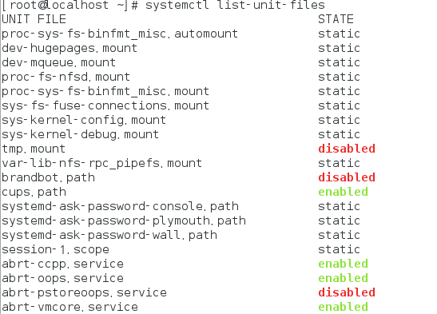

      * static : 다른 프로세스를 실행하면 종속적으로 실행되는 프로그램
      * enable : 실행중 disable : 실행안함
      * systemctl start / stop / restart / disabled / enabled 서비스이름 : 명령어 사용가능.
      * grep 명령어를 이용하여 원하는 목록확인(파이프라인 이용) 

      

      * firewalld : 방화벽 관련 프로그램 .service : 서비스 프로그램

    

> 부호 연산자 
>
> `|`	:	`명령1|명령2`  
>
> `>`  	
>
> `>>` 	
>
> `<`  
>
> `<<`
>
> `grep` 파일명	:	''파일명''을 포함한 파일 찾기.
>
> 
>
> 문서안에서 검색도 가능. `grep` `찾을단어` `파일명`
>
> `grep link 현재디렉토리파일명` 가져오고 싶을 때 :`ls -l | grep link`
>
> 현재디렉토리파일명을 파이프라인을 통해 받아온다.
>
> 
>
> 위에 두 문장은 같은 의미.
>
> 
>
> 

​    

1. 날짜 및 설정.

   * system-config-date 로 가능함(없으면 yum으로 설치) -> 딱히 필요 없다.
   * date를 쓰자.

   

2. 네트워크 설정

   * nmtui (수정하면 큰일나.... 건들지 말자...)

   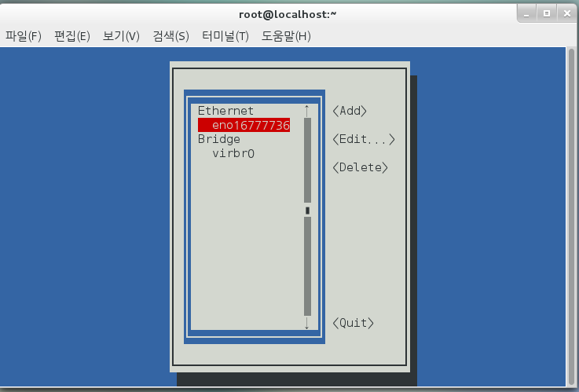

   

   * 여기서도 확인가능 (자주 사용하게 될 예정)

   

   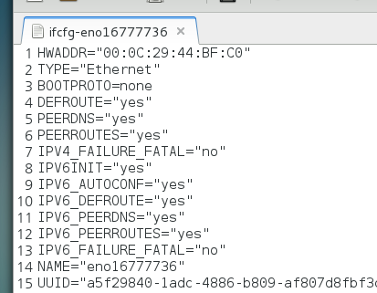

   

3. 방화벽 설정

   * firewall config를 통해 설정가능.

   

   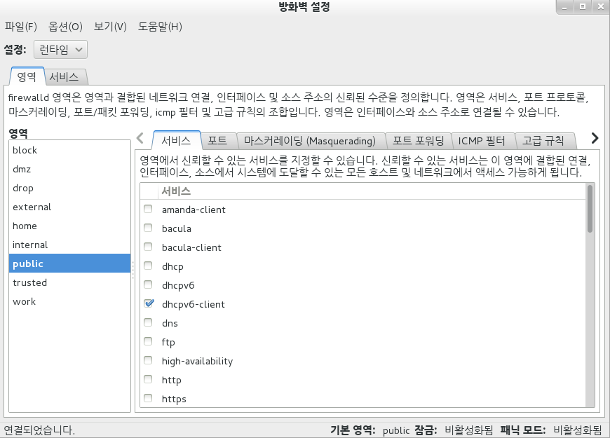

   * 나중에 tomcat 설치시 방화벽설정을 바꿔주어야 함(윈도우에서 접속을위해 리눅스의 방화벽을 닫아야함.)

### cron & at

* cron

  
  > d는 데몬이라는 의미

  * 주기적 특정 작업 자동 수행
  * cron의 형식

  

> * 백업파일 만드는 예제
>
>   * crontab에 아래 명령어 추가.
>
>     
>
>   * 앞으로 매월 15일 3시 1분만 되면 /etc/cron.monthly 프로그램을 실행하겠다는 의미.
>
> 아래의 파일을 생성
>
> 
>
> 아래와 같이 작성
>
> 
>
> `$ : 는 shell script 프로그래밍의 문법!`
>
> 날짜 변경해서 확인
>
> 
>
> restart를 통해 바뀐 환경을 적용해주어야함.
>
> 확인을 위해 date로 날자 변경후 1분을 기다리면....
>
> 아래와 같이 백업 파일이 만들어짐!
>
> 
>
> * 백업시간은... 사람이 없는 새벽시간때를 활용하자!

* at
  
  * 예약 시간 1번 특정 작업 수행
  
    
  
  > 2분뒤 예약 실습
  >
  > 
  >
  > at 명령에서 나올때 ctrl + d 를 통해 나옴
  >
  > 위의 명령은 2분뒤 백업을 진행한다는 의미.

### 네트워크 관련 설정과 명령어

#### 네트워크 개념

> 네트워크 통신
>
> a(프로토콜) - b(프로토콜)	둘이 문법이 맞아야 소통이됨.
>
> web : http 프로토콜. -> 고급 수준의 프로토콜 (tcp/ip에 의존성)
>
> http 의 내부 : TCP / IP 방식. (네트워크연결을 ip중심으로).

* TCP / IP
  * 프로토콜 중 가장 널리 사용되는 종류 중 하나다.
  * 통신의 전송/수신을 다루는 TCP와 데이터 통신을 다루는 IP로 구성된다.
  * window / linux 에 프로토콜이 설치되어 있다.

* telnet
  
* 원격으로 다른 컴퓨터로 접속 프로토콜.
  
* ssh
  
* 일종의 telnet 이지만 보안을 더 강화한 프로토콜.
  
* 호스트 이름과 도메인 이름

  * ip address : 네트워크 컴퓨터를 식별해 주는 번호
  * 4개의 숫자로 구성됨 : 70.12.80.90 -> IPV4 방식 , IPV6방식 혼용중.
  * 각 자리 0~255 까지 가능함.
  * 총 가능한 ip 갯수 = 256 * 256 * 256 * 256 개.
  * 전세계에 네트워크할 컴퓨터에 하나하나 모두 부여해야 함.
  * 서브넷 마스크 : 255.255.255.0 : 같은 네트워크로 묶으려면 첫번째, 두번째, 새번쨰 자리 같아야 하고 나머지 달라도됨. 네트워크 그룹을 결정하는것을 말함.

* 게이트웨이

  * 네트워크 외부로 나갈때 거쳐가는 곳.

  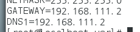

* DNS 서버 주소

  * nslookup뒤 url 작성.`nslookup 네트워크 경로를 보여주는 명령어`

    

  * 인터넷을 사용할 때 www.daum.net과 같은URL을 해당 컴퓨터의 ip 주소로 변환해주는 서버 컴퓨터를 말한다.
  * Domain Name System(DNS) 서버의 주소를 사용하지 않거나, 잘못 입력되어 있으면 정상적으로 웹 사이트에 접속되지 않으므로 올바른 정보를 설정해야 한다.
  * 설정 파일은 `/etc/resolv.conf`며, 내용 중에 `'nameserver DNS서버IP'`의 형식으로 설정되어 있다.
  * 보통 Gateway와 DNS를 같게 사용함.

#### 네트워크 관련 명령어

* 명령어

  * ifconfig    :  네트워크이름(종류), ip, dns, g/w 확인

    

  * nmtui   :     GUI로 보여줌. 네트워크조회/설정

  * ifup    :     네트워크 장치를 가동.

  * ifdown     :      네트워크 장치를 정지.

  

* 설정파일
  * / `etc` / `xxxxx` / `ifcgf-enoxxxxxxxx`

  * DNS정보 저장 파일 : `/etc/resolv.conf`

    

    * DNS를 추가설정할 수 있다.

  * 컴퓨터 도메인정보 : `/etc/hostname`

    * 나중에 `hadoop` 사용시 각 vm마다 도메인 바꿔줄 예정임.

    

  * 설정파일 수정후 반드시 `systemctl restart network`명령어를 사용한다.
  
  * 상태 확인시에는 `systemctl status network` 명령어를 사용한다.
  
    
  
  * `systemctl stop network`, `systemctl start network`명령어로 네트워크 `inactive`,`active` 가능하다.
  
    
  
    

### 리눅스 명령어

* 파이프

  * 명령을 조합.
  * `명령1` | `명령2`
    * 명령1의 결과를 명령2에 주어 명령문을 진행.

* 리다이렉션

  * 모든 터미널 멸열은 표준입력 키보드, 표준출력 모니터이다.
  * `명령어` > `파일이름` : 왼쪽에 실행결과물 `파일이름` 으로 저장
  * `>>` : 결과물을 추가
  * `명령어` < `파일이름` : 명령어를 입력파일로 지정

* 필터

  * `grep` 을이용.

  * 필터는 필요한 것만 알려주는 명령이다.

  * 문자열 정규표현식에 대한 패턴.`[0-9],[a,z].[A-Z]`

    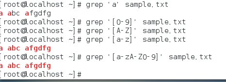

  * sort 이용

    

    * 줄 단위로 정령.

  * `<`와`>>`를 동시에 사용 가능하다

    

* 파이프라인 + `grep`

  * 원하는 파일 검색가능.

  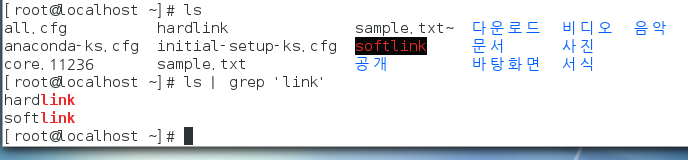

  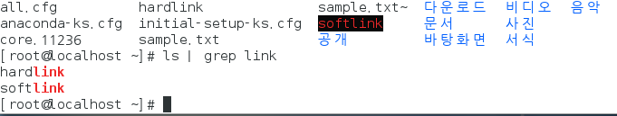

  * '문자열' 쓰나 안쓰나 똑같음.

  * 아래와 같은 문자열도 가능

    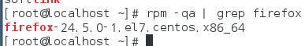

> grep은 혼자쓰기보다 파이프라인으로 연결되어 사용되는 경우가 많다!

### 프로세스

* 프로세스는 하드디스크에 저자된 실행 코드(프로그램)가, 메모리에 로딩되어 활성화된 것

* 프로그램 : 컴퓨터 실행 가능한 이진코드 집합체.

  * *.java --> 컴파일후 이진수로 변환된 파일이 생성됨. `.class` --> 실행

* 프로세스 : 현재 cpu가 실행중인 프로그램 
  * 서비스 : 백그라운드에서 동작중인 프로세스

    * 이중 항상 실행중인 서비스 :  `Demon`

  * 포그라운드 프로세스

    * 하나의 프로세스 밖에 수행못함.
    * ex) gedit 사용시 gedit을 종료하지 않으면 터미널 사용을 할수 없다.
    *  

  * 백그라운드 프로세스

    * gedit 실행시 뒤에 `&` 를 붙여 주면 백그라운드로 동작할 수 있다.

      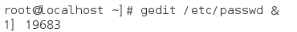

    * 백그라운드로 동작시 gedit 사용하면서 터미널로 다른 작업도 사용이 가능하다.

    * jobs 명령어를 통해 진행중인 백그라운드 프로세스를 알수 있다.

      

    * kill 명령어를 통해 종료가능하다.

      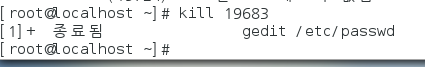

  * 모든 프로세스를 확인할때 `ps` -ef 명령어로 확인

    

    * 지금까지 한 작업이 모두 나타남.

    * 파이프라인 `grep`을 통해 원하는 것만 검색가능.

      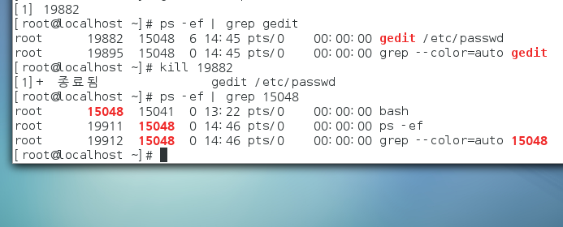

## FireFox 업그레이드.

* 낮은 버전에서는 tomcat 사이트 download에 접속이 안됨.

* 받아둔 FireFox 압축풀기

  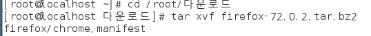

* 완료

  

* 모든 사용자가 다 사용할수 있는 폴더. `/usr` 폴더로 옮기기

  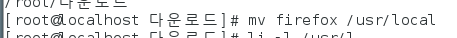

* 링크를 만들기

  

* 실행...

> * 링크를 만들어 옮겼을때..
> * firefox로 실행시 압축은 72 버전이었으나 73버전이 새로 나와서 자동으로 업데이트가 되어버림.
>   * 이상황에서... 실행시 오류가 생김.
> * 해결방법 : 링크 안쓰고 루트를 직접 입력해서 옮기지 않고 바로 실행함.
>
> 

## Tomcat 설치

* tomcat.apache.org 에서 톰켓 다운로드 or 윈도우에서 복붙

* 압축해제후 이름을 tomcat9로 변경한 후 `/usr/local`로 폴더를 이동.

* `/usr/local/tomcat9/bin/startup.sh`로 톰켓 서버 실행.

  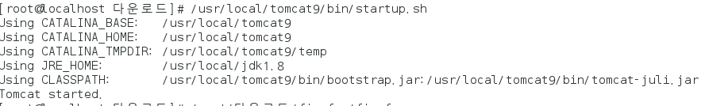

> Java path 설정이 안되 있다면 tomcat startup.sh를 실행할수 없다.!

* `/usr/local/tomcat9/bin/shutdown.sh`로 톰켓 서버 종료

  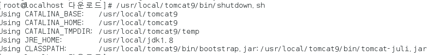

  

  

  

  

  

  

  

  

  

  

