# Hadoop

## 하둡 클러스터링 ( multi node 구성 )

* 1개 컴퓨터(vm) : Single node 운영
* 4개 컴퓨터 : multi clustering node

> 설치가 반이다.. 잘 안됨... 많이 복잡함.

* master virtual machine 하나 생성.

  

  

* Master 메모리는 2GB정도가 처리하는데 속도가 적당.

* 프로세스는 현재 컴퓨터 성능에 따라.

  

* setting 에서 .iso image 파일 지정후 리눅스 설치.

* vmnet.sys -> vm network 설정하는 프로그램

  

* 저번시간에 지정했던 CentOS 설치시 설정사항 고려하여 설치.

  * 언어설정 : 한국어

  * 키보드설정 : 영어추가

  * 소프트웨어선택 : 개발 및 창조를 위한 워크스테이션

  * 파티션 :  표준 파티션. `swap 2gb`, `/:(root) 나머지용량` 

  * 네트워크 : eno16777736 켬

  * root 암호설정, hadoop 계정생성

    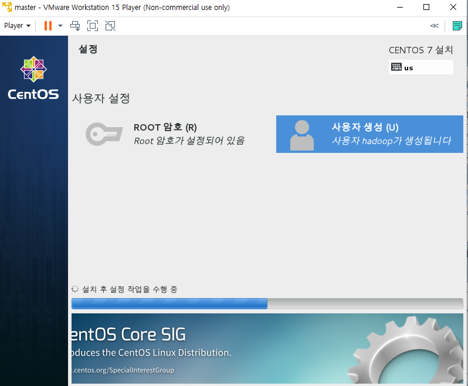

* kdump 비활성.

* root 계정으로 접속.

* 소프트웨어 탭에서 자동 업데이트 해제하기.(책과 버전을 맞추기 위함.)

  

* hadoop 은 linux 환경에서 사용가능

## 빅데이터(개념)

* 3V의 특성을 같는다.

  * 규모(Volume) - 데이터의 크기,데이터 생성 주기가 빠르다.

  * 다양성(Variety) - 다양한 종류의 데이터를 수용하는 속성. 각종형태 : 비정형 데이터

    > 정형 데이터 : 타입(길이) primary key

    

  * 속도(velocity) - 저장, 처리 속도가 빠르다.

* 5V 까지 확장. (정확성, 가치)

* 데이터 소스 - 수집 - 저장 - 처리 - 분석 - 표현
  * R은 분석 표현에 특화
  * hadoop은 분석 앞쪽 특화(저장, 처리)
  * 데이터 소스, 수집은 웹서버가 진행.

* master vm에 설치할 것들.
  * ip고정 설정.
  * jdk 설치
  * hadoop설치
  * 복사하여 여러 vm 으로 사용할 예정.

## Linux 환경 설정

### yum 업데이트 방지 설정

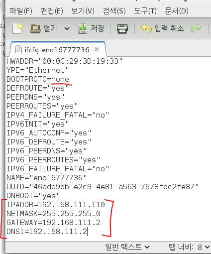

* dhcp -> none

* 아래내용추가.

  

* network 재시작
* ifconfig로 확인

### yum 자동 업데이트 해제.

* update block 주석처리

* updates-source 주석처리

* backup 파일 하나 생성.
*  cd /etc/yum.repos.d/  명령어를 사용하여 폴더로 이동.
* 다음 명령어 진행

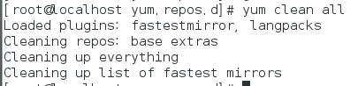

### selinux 사용 방지 설정

* 수업 편의를 위한 설정.

## Network 설정

* 내부적으로 랜덤 포트로 통신이 진행됨. 
* root에서 전체 방화벽 해제.

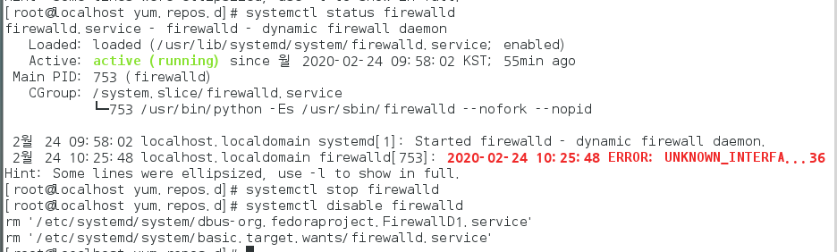

* 설정후 네트워크 재시작.

## JDK 설치

* hadoop 이 jdk를 이용한 응용프로그램
* openjdk 정보확인.

* openjdk 삭제

  

* 삭제확인

  

  

* root 계정에서 진행.

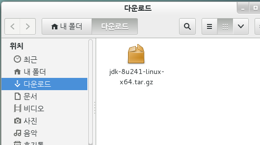

* jdk 압축 이동

  

* 압축해제

  

* soft link 만들기.(이름 짧게 쓰기위해)

  

* PATH 설정(가장 중요함.)

  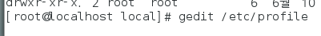

  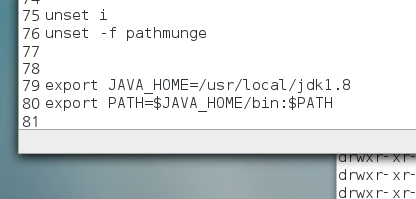

  * 리눅스에선 `:` 윈도우에선 `;`

    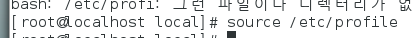

    * source 명령어로 path 재설정 함.

  * reboot 진행

  * 재실행후 바로 터미널에서 진행

    

  * 설치완료.

  * PATH 에 있는 경로들은 path 를 적지 않아도 실행이 가능.

## hadoop 설치

### 1. VM 연결 환경설정.

* 하둡을 위한 4개 VM을 서로 연결하는 과정.

* HDFS (Hadoop Distributed File System) : 분산 파일 시스템.
* hadoop 계정에서 진행.
* 하둡 설치 압축파일을 윈도우에서 가져오기.

* hadoop 계정 로그아웃.

* host 이름을 바꾸기.

  1. 현재 호스트 이름 확인.

     

     * 변경하자..(ip로 식별하면 구분하기 힘드므로 이름을 지정.)

  2. 이름 변경후 확인.

     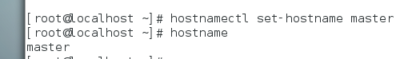

  3. VMWare종료후 master 파일을 복사후 이름 지정.

     

     

  4. VMware에서 openVM 클릭

     

  5. 가져온후 이름 변경

     

  6. network에서 mac Address확인

     

     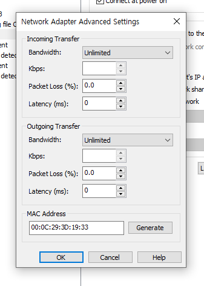

     * generate로 새로 생성
     * 실행 후 I Moved it으로 실행.

  7. root계정으로 접속한 후 network 설정.

     * 터미널에서 `gedit /etc/sysconfig/network-scripts/ifcfg-eno16777736`에서 ip설정.

     * MAC adress와 ipaddr 변경.

       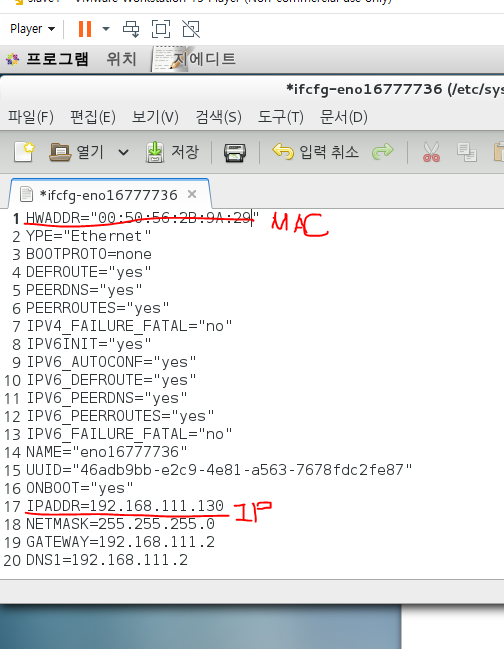

  8. hostname 을 slave1로 변경.

     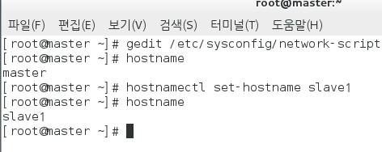
  
  9. 네트워크 재시작.
  
     
  
  10. 재부팅.
  
  11. 동일하게 2,3도 진행.
  
  
  
  
  
  12. 4대 동시에 켠후.
  
      * master에서
  
        * 아래와 같이 수정
  
        
  
        * 나머지 4개의 컴퓨터에도 동일하게 작성.
  
  13. ping으로 접속확인.
  
      
  
  14. 또는 ssh 프로토콜을 이용하여 원격으로 접속.(telnet 방식접속)
  
      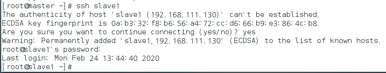
  
  15. who를 통해 현재 접속한 계정 정보 알수있음.
  
      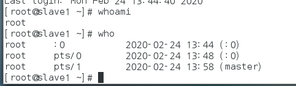
  
  16. exit으로 로그아웃
  
      
  
  
  
  
  
### 2. ssh key

* ssh key를 이용하여 vm끼리 접속시 암호 없이 접속하기.

   * 마스터의 `hadoop`계정에서 아래 명령어 수행.

     

   * 전부 enter로 넘김

     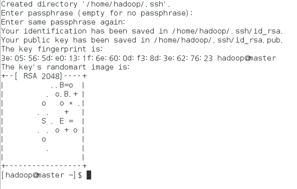

   * ssh-copy-id 로 넘겨주기.

     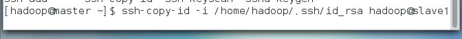

     * 경로는 위에 생성된 _rsa의 경로.

   * slave1의 hadoop 암호 입력

     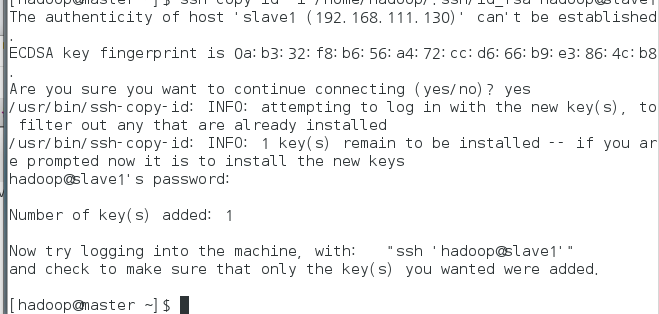

   * 암호 없이 접속되는지 확인후 exit(암호없이 접속이 되야 key값을 부여 받은것.)

     

   * slave2, 3도 동일하게 진행.
   * 위 수행 결과 4대의 컴퓨터 hadoop 계정끼리 서로 암호없이 접속 가능.

### 3. 하둡설치

   1. 하둡 설치 압축파일 해제.

      
   
      압축 해제후...확인
   
      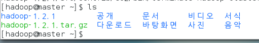
   
   2. slave도 모두 압축 해제.
   
      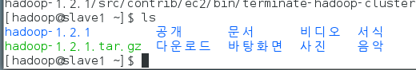
   
      
   
      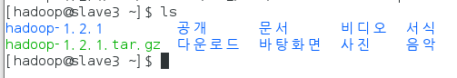
      
   3. master에서 hadoop/conf 로 이동
   
      
      
   4. 수정할 파일들
      
   * 디렉토리 하나 생성.
     
     
     
   * 확인
     
     
     
   * masters
     
        
            
        
            
        * 내용 slave1으로 작성. (두번째 master역할을 지정함)
        
      * slvaes
      
        ​	
      
        * 모두 작성
      
          
      
      * hdfs-site.xml
      
        * 열기
      
          
      
        * 작성
      
          
      
          * dfs : 한개의 파일을 3개의 파일로 나눠서 저장하겠다는 의미.
      
        * 저장 후 닫기.
      
      * core-site.xml
      
        * 열기
      
          
      
        * 작성
      
          
      
        * 저장 후 닫기.
      
      * mapred-site.xml
      
        * 열기
      
          
      
        * 작성
      
          
      
        * 저장 후 닫기.
      
      * hadoop-env.sh
      
        
      
        ​		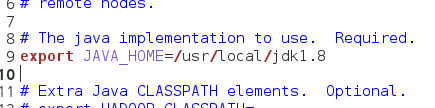
      
        * 주석 해제후 자바 경로 변경.
        * 저장후 닫기.
      
      * 위 6개 파일을 master에서 진행후 slave에 복사.
      
        * 복사할 파일. `hadoop-env.sh`,`***-site.xml` 총 4개 slaves에 복사.
      
        * 복사하는법
      
          1. scp 명령어 이용 `scp : ssh로 cp를 진행한다는 명령어
      
          2. xml도 복사.
      
             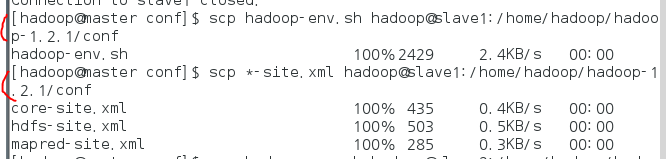
      
          3. 2,3 도 동일하게 진행.
      
        * 하둡 PATH 설정.
        
        * `.bash_profile` 열기
        
          
        
        * 아래와 같이 맨아래 3줄 추가.
        
          
          
        * source로 설정저장.
        
          
        
        * 확인해보기.
        
          

### 4. 설치 확인하기

   1. 확인1

      

      * 하둡 저장소 초기화 하는 명령어

      

      * successfully formatted 나오면 정상.

   2. 확인2

      

      * 실행후 `JobTracker` 와 `NameNode` 실행이 되는지 확인.

        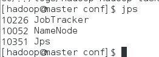
      
      * slave1에서 jps로 아래 같이 뜨는지 확인
      
      
      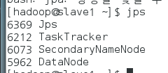
      * slave2, 3는 jps시 아래와 같이 뜨는지 확인.
      
        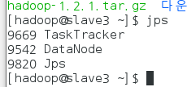
      
   * 확인후 master에서 중단.
     
     
     
   * 종료.
     
        

​      

​      

​      

​      

​      

​      

   

