# 2020-03-11

---

> 시작전 먼저 DB 구동하기!
>
> 
>
> 종료 명령어는 `mysqladmin -u root shutdown`

## 웹서버 Import

1. Encoding 변경

   * window preferences general workspace 에서 인코딩 변경

     

   * 여기도 변경! (CSS, HTML, JSP 모두~)

     

2. WAS 설정

   - 웹에서 tomcat 7 다운받기~

   - 서버 지정하기!

     

3. 이클립스 설정

   - 압축 파일채로 eclipse에 Import

     

     

   - Import 후 . x표가 있음

   - properties 들어가서 buildpath 재설정

     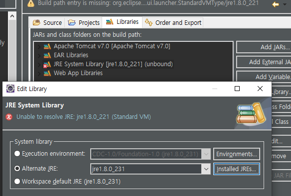

   - DB설정 바꾸기.
   
     - WebContent 에서 context.xml 설정
   
       
   
4. Project configure 진행

   

5. Web Program 호출해보기

   * Context root 확인하여 접속

     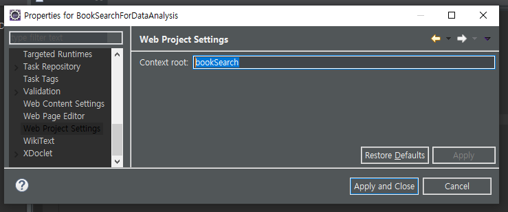

   * 컨트롤러에서 지정한 url 로 접속해보기 `http://localhost:8080/bookSearch/search?keyword=java` 

     * JSON 결과 확인!

     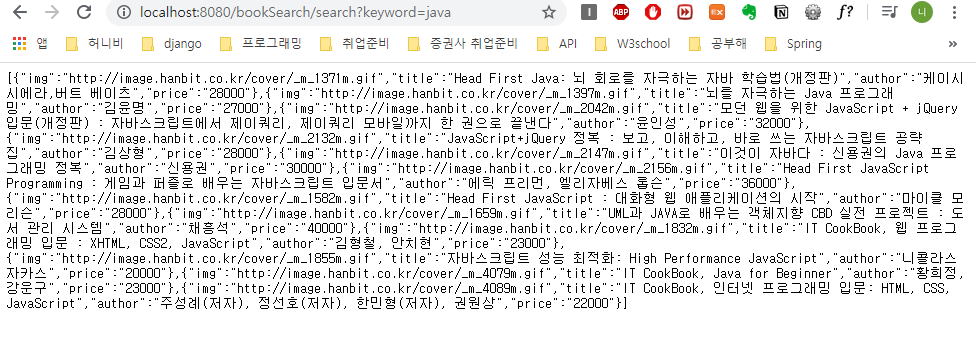
     
   * Round Trip 방식.
   
     * Client - webserver - WAS - DB.
     * WAS가 JSP 파일 형태로 webserver로 전송하여 매번 새로운 JSP 파일로 Client에게 전송.
     * 모든 작업이 server단에서 이뤄짐.
     * 클라이언트 서버가 주고받는 데이터량이 많음.
   
   * Client와 server를 나눔.(SPA : Single Page Application)
   
     * FrontEnd Web Application(HTML, CSS, JS(JQuery))
     * JQuery 유지보수 힘들다...(이를위해 Angular, react 가 생겨남.)
     * Back과 Front사이에서 CSV,XML,JSON 형태로 자료를 서로 주고받음.
     * mvc 패턴을 적용하여 편리하게 사용도 가능.

---

* JSON

  * 데이터 전달 표준.

  * 형식 `{ name : "홍길동"}` key : value

  * 여러개의 객체를 배열로 표현도 가능. `[ { name : "홍길동"}, { name:"김길동"} ]`

  * 크롬 webstore에서 parsing 프로그램(plugIn) 다운로드 받아서 볼수 있다. `json formmatter`

    

  * `JSON Formmater 적용후`

    

* 한글처리를 위해서는...

  * 톰켓의 server.xml에서 인코딩 설정이 가능함.

    

  * URIEncoding 속성을 추가

    

---

## R로 웹 데이터 받아오기

1. 결과로 얻은 JSON을 Data Frame으로 변환하기.

   * 외부패키지 이용. : `jsonlite`

     ```R
     install.packages("jsonlite")
     require(jsonlite) # JSON 처리를 위해서 loading
     install.packages("curl") #dependancy 걸려있는 패키지.
     require(curl) 
     require(stringr) # 문자열 처리를 위해서 loading
     ```

   * URL 만들기.

     ```R
     url <- "http://localhost:8080/bookSearch/search?keyword="
     
     request_url <- str_c(url,scan(what=character())) #실제 호출할 URL
     
     request_url
     df <- fromJSON(request_url) # JSON을 data Frame 으로 저장.
     ```

   * 결과

     ```R
     View(df)
     ```

     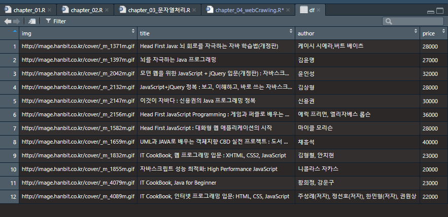

2. 책 제목만 출력하기.

   ```R
   # nrow(df) : row의 갯수
   for (i in 1:nrow(df)) {
     print(df$title[i])
   }
   ```
   
   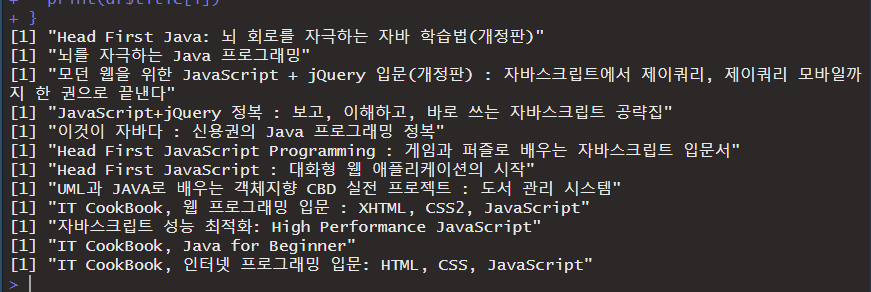

3. 외부 API를 이용하여 JSON데이터를 획득한 후 결과를 출력하기.

   * 사용할 API : `영화진흥위원회 OPEN API`: [Link](https://www.kobis.or.kr/kobisopenapi/homepg/main/main.do)

   * 사용전 키 발급 받아야함!

     

   * 다음의 url에서 자신의 키값으로 사용

     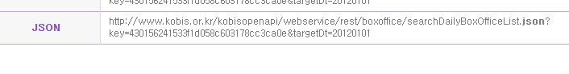

     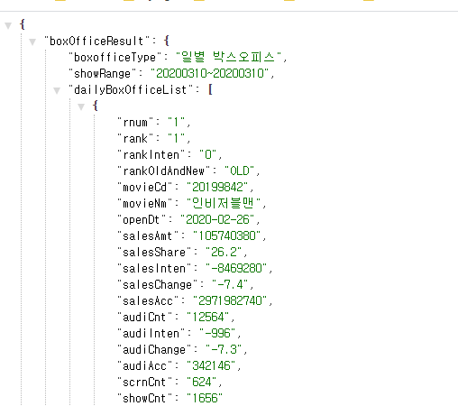

   * 결과가 JSON 안에 JSON 이 있는형태.

     

   *  1 : JSON 으로 이루어진 JSON

   *  2 : JSON 배열로 이루어진 객체

   * 가져온 JSON을 data fram으로 저장!

     ```R
     url <- "http://www.kobis.or.kr/kobisopenapi/webservice/rest/boxoffice/searchDailyBoxOfficeList.json?key=2b28381965c8d739d439fad98c6ebe85&targetDt=20200310"
     
     df <- fromJSON(url)
     ```

     

   * 아래와 같은 형식으로 접근 가능.

     ```R
     f[[1]]
     df[["boxOfficeResult"]] 
     #JSON 구조를 보면서 mapping 하면서 찾아가기.
     df$boxOfficeResult$dailyBoxOfficeList$movieNm
     
     for (i in 1:nrow(df$boxOfficeResult$dailyBoxOfficeList)) {
       print(df$boxOfficeResult$dailyBoxOfficeList$movieNm[i])
     }
     ```

     

     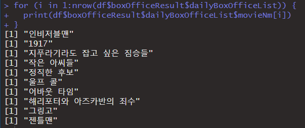

     

     

## 웹페이지 처리.

  * 스크랩핑(web scraping) : 웹페이지 에서 원하는 부분을 가져오는 행위
       * selector 나 xpath를 알아야 함.
  * 크롤링(web crawling) : 스크랩핑으로 여러 페이지를 여는 행위.


### Web Scraping

* CSS,jQuery(selector) 개념이 필요함.
* 또는 XPATH를 이용하는 방식.

> 일반적으로는 `XPATH`가 조금 더 정확한 처리가 가능하나 둘의 차이는 사용하는 시스템의 구조에 따라 사용하는것이 다름.

* selector를 가지고 웹 스크래핑을 하는방법.

* web storm을 이용하여 selector 기초 공부.

  

* 설치후 HTML 파일로 학습진행. (jQuery 사용 예정.)

  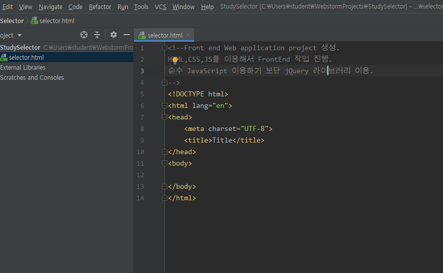

* jQuery는 library형태로 코드가 구현되기 때문에 유지보수에 문제가 발생. 
* Angular, React같은 Web framework를 이용하여 프론트엔드 개발을 진행.


* web storm 안에 webserver가 존재함.

* web storm이 버튼 한개로 진행 가능.

  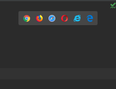

#### 선택자(selector)

* 기본선택자

  1. tag selector : tag 명으로 원하는 부분을 지칭.
  2. 전체 선택자 (Univasal selector) : `*` 이용하여 모든 영역을 선택할 수 있다.
  3. id selector : `#`을 이용하여 원하는 영역을 선택할 수 있다. (id는 unique 함)
  4. class selector : `.`을 이용하여 원하는 영역을 선택할 수 있따.(unique 하지 않다.)

* 구조선택자

  * 자식 선택하기
    * `ol > .myClass` 처럼 `>` 를 이용하여 특정 tag 안에 있는 class를 표시할 수 있다.
  * 후손은 공백으로 표시.
  * 형제중 바로 다음 형제는 `+` 이용.

  ```css
  #In + li.myclass{
              color : black;
          }
  ```

### 특정 웹페이지 scraping

#### selector 이용

* 필요 패키지 : `rvest`

  ```R
  # 필요 package.
  install.packages("rvest")
  library(rvest)
  library(stringr)
  # scaping할 페이지의 url을 알아보기.
  url <- "https://movie.naver.com/movie/point/af/list.nhn?&page="
  request_url <- str_c(url,1)
  ```

* html 문서를 받아오는 함수 : `read_html()`

  ```R
  page_html &lt;-read_html(request_url, encoding = &quot;CP949&quot;)  #저장할 html 문서. 인코딩 신경쓰기. 페이지의 인코딩에 따라 맞춰서 가져온다.ㅇ
  ```

* 웹페이지에서 다음 도구를 이용해 tag 위치를 알수있다.(Chrome)

  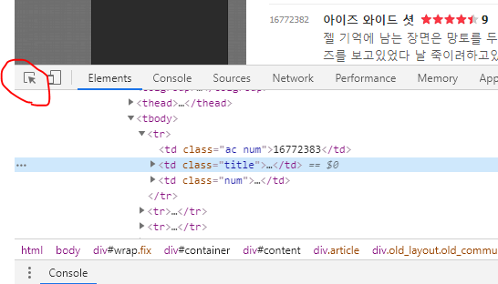

* 다음 tag를 찾으려면..

  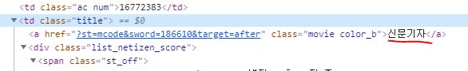

  * selector : `td.class > a.movie`  

* selector 잡아주는 함수 : `html_node()`

  ```R
  # 가져올 selector : "td.title > a.movie"
  # html 중에 selector에 맞는 element가져오기.
  nodes = html_nodes(page_html,"td.title > a.movie")
  # 가져온 element중 text만 추출.
  movie_title <- html_text(nodes) # 제목들 추출
  
  nodes = html_nodes(page_html,"div.list_netizen_score > em")
  movie_point <- html_text(nodes) # 평점들 추출
  
  ```

  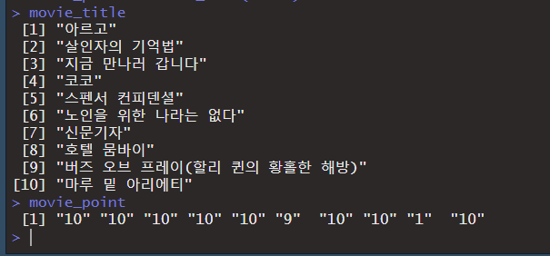

  * 내용만 가져오기

    ```R
    nodes = html_nodes(page_html,"td.title") 
    
    contents = html_text(nodes) ##텍스트 추출.
    
    contents <- str_remove_all(contents,"[\t\n()]") ## 특수문자 제거. ()없을 때 title 제거시 "버즈 오브 프레이(할리 퀸의 황홀한 해방)"가 지워지지 않았음.
    contents <- str_remove(contents,movie_title) ## 앞쪽 영화제목 제거.
    contents <- str_remove(contents,"별점 - 총 10점 중") ## 총점 포멧제거.
    contents <- str_remove(contents,movie_point) ## 각 개인의 총점 제거.
    contents <- str_remove_all(contents,"신고") ## 마지막 " 신고" 제거.
    ```

    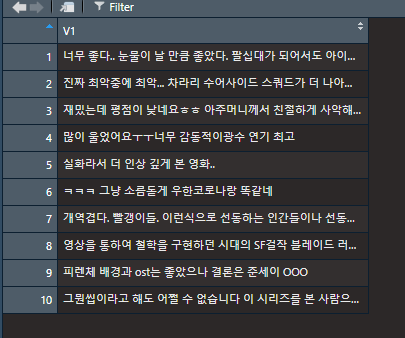

    

#### xpath 이용

