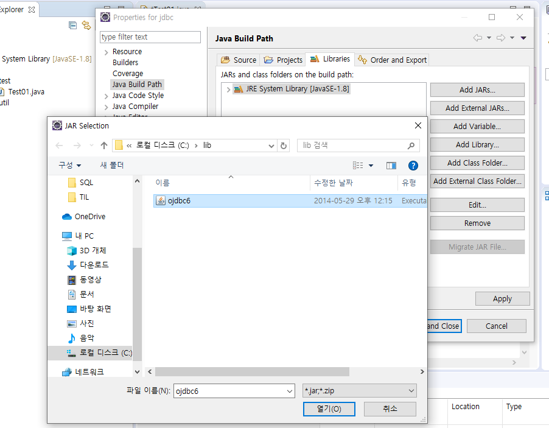
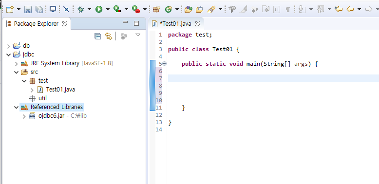

## VIEW

```sql
--뷰란?
-- 뷰는 하나의 가상 테이블이라 생각 하면 된다. 
-- 뷰는 실제 데이터가 저장 되는 것은 아니지만 뷰를 통해 데이터를 관리 할수 있다. 
-- 뷰는 복잡한 Query를 통해 얻을 수 있는 결과를 간단한 Query로 얻을 수 있게 한다. 
-- 한 개의 뷰로 여러 테이블에 대한 데이터를 검색 할 수 있다. 
-- 특정 평가 기준에 따른 사용자 별로 다른 데이터를 액세스할 수 있도록 한다. 

-- 각 부서에서 최대 급여를 받는 사원의 목록 
```


```sql
--view 생성.
select * from emp 
where (deptno,sal) in (select deptno,max(sal) from emp group by deptno) 
order by deptno;

create or replace view max_dept
as 
select * from emp 
where (deptno,sal) in (select deptno,max(sal) from emp group by deptno) 
order by deptno; -- select 결과값으로 max_dept를 만듬. insert같은건 안됨. 읽기전용
```

* VIEW는 읽기 전용.

* 어제했던 paging 처리 view 이용

```sql
create or replace view paging_emp as
select *
from (
	select rownum row#, ename,job,sal
	from (select * from emp order by sal desc)
); 

select * from paging_emp where row# between 1 and 5;
```

## sequence - 오라클에서만 사용

```sql
############################################
--sequence
############################################
--시퀀스란?
-- 유일(UNIQUE)한 값을 생성해주는 오라클 객체이다. 
-- 시퀀스를 생성하면 기본키와 같이 순차적으로 증가하는 컬럼을 자동적으로 생성 할 수 있다. 
-- 보통 PRIMARY KEY 값을 생성하기 위해 사용 한다. 
-- 메모리에 Cache되었을 때 시퀀스값의 액세스 효율이 증가 한다. 
-- 시퀀스는 테이블과는 독립적으로 저장되고 생성된다.
```


```sql

	select * from emp2;
	select * from dept2;

	
	delete from emp2;
	delete from dept2;

	select * from book;
	
	delete from book;
	
	create sequence dept_seq; --시퀀스 생성
	
	insert into dept2 (deptno,dname,loc) values(dept_seq.nextval, 'EDU','SEOUL');
	
	select dept_seq.currval from dual; -- 현재 시퀀스 확인
	select dept_seq.nextval from dual;

	drop sequence deept_seq; -- 시퀀스 삭제

	create sequence dept_seq start with 10 increment by 10; -- 10부터 10씩 증가하는 시퀀스
	
	
	create sequence dept_seq start with 10 increment by 10; -- 10부터 10씩 증가하는 시퀀스
	
	insert into dept2 (deptno,dname,loc) values((select nvl(max(deptno),0)+1 from dept2), 'EDU','SEOUL');
	
	 select nvl(max(deptno),0)+10 from dept2;
	 
	 
	 --nvl 오라클에서만 사용.
```

## 오라클 DB연동

1. 드라이버 셋팅 우선.


> ojdbc6 반드시 필요함.


configure build path

[ojdbc6 위치](C:\oraclexe\app\oracle\product\11.2.0\server\jdbc\lib) 

C:\oraclexe\app\oracle\product\11.2.0\server\jdbc\lib





### jdbc 프로그래밍 순서

**jdbc** **프로그래밍** **순서** 

 **0.** **연결할 driver**클래스를 classpath아래==>maven **설정으로** **대체**

 

**1. Driver**클래스를 **로딩**

 

**2.** **로딩된 Driver**클래스를 **이용해서 Connection**요청(url, user, pwd)

 

**3.** **생성된Connection**으로부터 Statement생성

 

**4.** **생성된 Statement**를 **이용해서 sql**수행(execute, executeUpdate, executeQuery)

 

**5.** **결과** **처리(ResultSet, int)**

 

**6. SQLException** **처리(try, catch, finally)**

 

**7.** **자원정리(connection, statement, resultset)**

 

```java
package test;

import java.sql.Connection;
import java.sql.DriverManager;
import java.sql.PreparedStatement;
import java.sql.ResultSet;
import java.sql.Statement;

public class Test01 {

	public static void main(String[] args) {
		System.out.println("JDBC TEST");
		
		String driver="oracle.jdbc.OracleDriver"; // 특정 DB정보. 컴파일이 아니라 runtime에서 결정될 정보.
		String url="jdbc:oracle:thin:@127.0.0.1:1521:xe"; // 환경설정으로 밖으로 나갈 정보.
		String user="SCOTT";
		String pw="TIGER";
		
		String sql = "select * from emp";
		
		Connection con = null; // 특정DB에 연결
		PreparedStatement ps = null; // sql구문 관리
		ResultSet rs = null; // select문 의 결과값 표. dml(insert delete update) 결과값은 int가 나옴.
		
		try {
			//1. Driver클래스를 로딩
			Class.forName(driver);//메모리에 올라가 관리.
			
			con = DriverManager.getConnection(url,user,pw); // connection 만듬.
			System.out.println(con);
		} catch (Exception e) {
			
		}finally {
			
		}
		
		System.out.println("JDBC TEST END");
		
		
		
	}

}

```


 