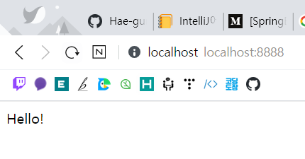
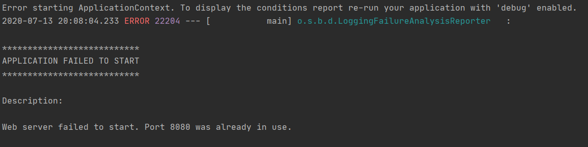

# IntelliJ 에서 SpringBoot 프로젝트 생성하기

## 1. Spring initializr 설치

* `IntelliJ` 에서 Spring Bootfmf 이용하기 위해서는 `Spring Boot Plug-in`이 필요하다.
* 아래와 같은 방법으로 해당 플러그 인을 설치해 준다.


1. 

2. 

3. 여기서 Spring Boot 를 찾아서 설치해준다.

   

4. 근데 난 아무리 찾아도 없었다.... 그래서 Installed를 눌러보니...

   

   * 깔렸는데 활성화가 안되어 있었다.
   * 나처럼 못 찾은 사람은 Installed 눌러서 해당 Plug-In 을 활성화 시켜주자.


## 2. 프로젝트 생성하기.

* 위와 같이 Plug-In 을 설치하게 되면 이제 New Project를 누르면 아래와 같은 새로운 탭의 `Spring Initialiazr` 가 생기게 된다. 설정후 NEXT를 눌러준다.

  

* 두번째 화면은 프로젝트 이름, 빌드할 때 Maven/Gradle 중 어떤것을 사용할 것인지, 자바 버전 등 프로젝트의 기본적인 사항을 물어본다. 프로젝트 정보를 입력하고 Next 버튼을 누른다.

  

* 세번째 화면에서는 프로젝트에서 필요한 의존성을 추가한다. 필요한 것들을 선택한 후 Next버튼을 눌러준다.(필자는 Lombok, Spring Web, Thymeleaf, JDBC, Oracle을 추가함.)

  

* 다음은 프로젝트가 저장되는 경로를 지정한다.

  

* Finish를 누르면 오른쪽 아래 maven이 필요한 라이브러리를 다 받아줄때 까지 기다리자.. 완료가 되면 프로젝트 만들기 성공!

  

* 간단한 컨트롤러를 만들어 테스트를 해보자.

  ```java
  package com.example.demo;
  
  import org.springframework.stereotype.Controller;
  import org.springframework.web.bind.annotation.GetMapping;
  import org.springframework.web.bind.annotation.RestController;
  
  import java.util.HashMap;
  import java.util.Map;
  
  @RestController
  public class DemoController {
  
      @GetMapping(value = "/")
      public String mainPage(){
          return "Hello!";
      }
  
      @GetMapping(value = "/sub")
      public Map<String,String> subPage(){
          Map<String,String> map = new HashMap<>();
          map.put("name","홍길동");
          map.put("age","18");
          return map;
      }
  
  }
  
  ```

* `http://localhost:8888/`

  

* `http://localhost:8888/sub`

  


> # 포트 충돌이 날때!
>
> * 기본적으로 Spring Boot 는 Tomcat이 내장되어 있는데 Default port 번호는 8080으로 되어있다.
>
> * 여기서 실행시 다른 프로그램이 8080포트를 사용하고 있다면 프로젝트는 실행이 되다가 아래와 같은 에러메세지와 함께 프로젝트가 강제로 종료된다.
>
>   
>
> * 이때는 Tomcat의 포트번호를 변경해 주어야 한다.
>
> * 포트 번호 변경은 `src/main/resources` 폴더 안에있는 application.properties 파일에서 아래와 같이 작성해 주어 설정할 수 있다. (JDBC 설정또한 이 파일에서 설정 가능)
>
> * `application.properties`
>
>   ```properties
>   # Tomcat port 설정
>   server.port = 8888
>   
>   # JDBC 설정 (Oracle)
>   spring.datasource.driver-class-name=oracle.jdbc.driver.OracleDriver
>   spring.datasource.url=jdbc:oracle:thin:@localhost:1521/xe
>   spring.datasource.username=유저이름
>   spring.datasource.password=비밀번호
>   ```

## 3. JSP 설정하기!

* 저번 포스트에서 말했듯... Spring Boot 는 기본적으로 JSP 설정이 되어있지 않다.
* 그러므로 저번 [포스트](https://github.com/Hae-gun/TIL/blob/master/Spring boot/Spring Boot day03.md) 에서 했던 방식 그대로 JSP 설정을 진행할 예정.