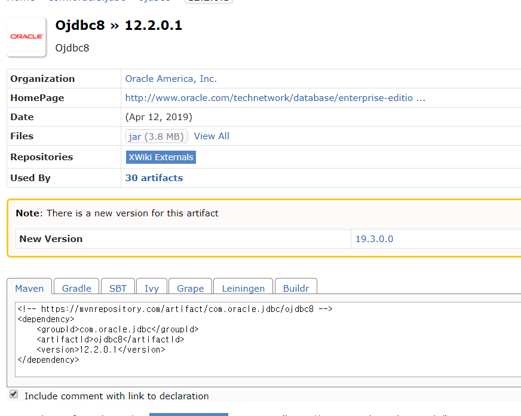
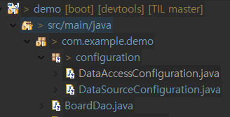

# Spring Boot day03

## 스프링 부트 JSP 설정하기.

* spring-boot-starter-web 에 포함된 tomcat은 JSP 엔진을 포함하고 있지 않다.

1. porm.xml 설정

   ```xml
   <dependency>
       <groupId>javax.servlet</groupId>
       <artifactId>jstl</artifactId>
   </dependency>
    
   <dependency>
       <groupId>org.apache.tomcat.embed</groupId>
       <artifactId>tomcat-embed-jasper</artifactId>
   </dependency>
   ```

2. apllication.properties 에 아래 내용 추가

   ```properties
   spring.mvc.view.prefix=/WEB-INF/jsp/
   spring.mvc.view.suffix=.jsp
   ```

3. jsp 파일은 Springboot의 templates 폴더안에서 작동하지 않는다

   * 그러므로 `/webapp/WEB-INF/jsp` 폴더를 만든 다음 jsp 파일을 넣어야 한다.

   

4. 그후 `Controller` 에서 url 을 Mapping  시켜주면 된다.

   ```java
   package com.example.demo;
   
   import org.springframework.stereotype.Controller;
   import org.springframework.web.bind.annotation.GetMapping;
   import org.springframework.web.bind.annotation.RequestMapping;
   
   @Controller
   @RequestMapping("/hello")
   public class HelloController {
   
   	@GetMapping
   	public String hello() {
   		return "hello";
   	}
       
       @GetMapping("/viewtest")
   	public String test() {
   		return "viewtest";
   	}
   }
   ```

   * `/hello`

   

   * `/hello/viewtest`

   


## DB 설정

* Spring boot 에서 오라클 DB 연동 + Mybatis 설정하기.

### 1. 라이브러리 설정

* 메이븐을 통해 필요한 jar 파일을 다운로드 한다.

  * porm.xml

  ```xml
  		<!-- mybatis -->
  		<dependency>
  			<groupId>org.mybatis</groupId>
  			<artifactId>mybatis</artifactId>
  			<version>3.4.0</version>
  		</dependency>
  		<dependency>
  			<groupId>org.mybatis</groupId>
  			<artifactId>mybatis-spring</artifactId>
  			<version>1.3.0</version>
  		</dependency>
  
  		<!-- oracle jdbc -->
  		<dependency>
  			<groupId>com.oracle.jdbc</groupId>
  			<artifactId>ojdbc8</artifactId>
  			<version>12.2.0.1</version>
  		</dependency>
  ```

  * ojdbc는 다운로드가 안됨...

  * 메이븐 저장소에서 jar를 직접 다운로드 후 `C:\Users\유저명\.m2\repository\com\oracle\jdbc\ojdbc8\12.2.0.1` 에 저장해준다.

    

    

### 2. properties 설정

* properties 에서 아래와 같이 기본적인 Database 설정을 지정해 준다.

  ```properties
  spring.datasource.driver-class-name=oracle.jdbc.driver.OracleDriver
  spring.datasource.url=jdbc:oracle:thin:@localhost:1521/xe
  spring.datasource.username=유저이름
  spring.datasource.password=비밀번호
  ```

### 3. Mybatis 연결

* Mybatis 는 자바 퍼시스턴스 프레임워크의 하나로 XML 서술자나 애너테이션을 사용하여 저장 프로시저나 SQL 문으로 객체들을 연결시킨다.

* Mybatis 연결을 위해서 sqlsession과 sqlsessionFactory 를 bean 등록해주어야 하나 Spring 에서는 xml을 통해서 연결했지만 boot 에서는 java 클래스로 등록이 가능하다.

  

  * `DataSourceConfiguration.java`

  ```java
  package com.example.demo.configuration;
  
  import javax.sql.DataSource;
  
  import org.springframework.boot.context.properties.ConfigurationProperties;
  import org.springframework.boot.jdbc.DataSourceBuilder;
  import org.springframework.context.annotation.Configuration;
  
  @Configuration
  public class DataSourceConfiguration {
  	
  	@ConfigurationProperties(prefix = "spring.datasource")
  	public DataSource dataSource() {
  		return DataSourceBuilder.create().build();
  	}
  }
  ```

  * `DataAccessConfiguration.java`

  ```java
  package com.example.demo.configuration;
  
  import javax.sql.DataSource;
  
  import org.apache.ibatis.session.SqlSessionFactory;
  import org.mybatis.spring.SqlSessionFactoryBean;
  import org.mybatis.spring.SqlSessionTemplate;
  import org.mybatis.spring.annotation.MapperScan;
  import org.springframework.context.annotation.Bean;
  import org.springframework.context.annotation.Configuration;
  import org.springframework.core.io.support.PathMatchingResourcePatternResolver;
  
  @Configuration
  @MapperScan(basePackages = "com.example.demo.dao")
  public class DataAccessConfiguration {
  	@Bean
  	public SqlSessionFactory sqlSessionFactory(DataSource dataSource) throws Exception{
  		
  		SqlSessionFactoryBean sessionFactory = new SqlSessionFactoryBean();
  		
  		sessionFactory.setDataSource(dataSource);
  		sessionFactory.setMapperLocations(
  				new athMatchingResourcePatternResolver().getResources("classpath:mybatis/mapper/*.xml")
          );
  		
  		return sessionFactory.getObject();
  	}
  	
  	public SqlSessionTemplate sessionTemplate(SqlSessionFactory sqlSessionFactory) {
  		return new SqlSessionTemplate(sqlSessionFactory);
  	}
  }
  
  ```

* 사용 되는 VO 객체 - db 스키마와 같은 형태로

  

  * User

  ```java
  package com.example.demo.model;
  
  import lombok.Data;
  
  @Data
  public class User {
  	private String id;
  	private String password;
  	private String name;
  	private String role;
  	
  	public String getId() {
  		return id;
  	}
  	public void setId(String id) {
  		this.id = id;
  	}
  	public String getPassword() {
  		return password;
  	}
  	public void setPassword(String password) {
  		this.password = password;
  	}
  	public String getName() {
  		return name;
  	}
  	public void setName(String name) {
  		this.name = name;
  	}
  	public String getRole() {
  		return role;
  	}
  	public void setRole(String role) {
  		this.role = role;
  	}
  	
  	
  }
  
  ```

  * 여기서 `@Data` 어노테이션 이용을 위해선 디펜던시에 아래와 같이 추가!

  ```xml
  		<dependency>
  			<groupId>org.projectlombok</groupId>
  			<artifactId>lombok</artifactId>
  			<version>1.18.8</version>
  			<scope>provided</scope>
  		</dependency>
  ```

* 사용될 dao

  * dao 는 Spring 과 mapper 를 연결해 준다.