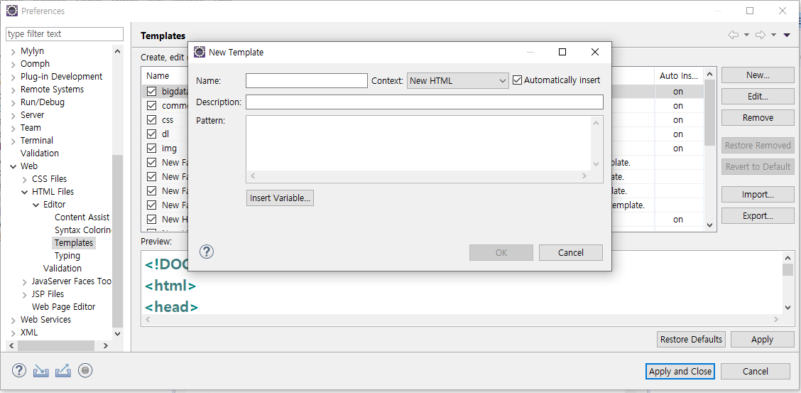

#### 웹공부

[mdn](https://developer.mozilla.org/)

[devdocs](https://devdocs.io)

[can i use](https://caniuse.com/)

[Javatpoint](https://www.javatpoint.com/)

## Template 만들기

* preferences -Web-HTML Files-Editor-Templates
* new로 새로 만들기. 
* Context -> new HTML로 설정.



* 지정후 new HTML에서 만든 Template 선택.


### 

## TAG

---

```html
<br> : 줄바꾸기. -> 여러번 인식.
<p> : 단락 -> 여러번 써도 1번 만인식.
    
    <!DOCTYPE html>
<html>
<head>
<meta charset="UTF-8">
<title>처음 만든 웹페이지</title>
</head>
<body>
여기 쓴 내용이 보입니다.<br /> 
456676867<p><p><p>
줄변경 안되었네요.<br><br><br>
줄변경 안되었네요.
줄변경 안되었네요.<br />
asdasd<br />
</body>
</html>
```

#### 결과


### Image Tag

```html
<!-- html 주석. --> 
<!--Eclipse 단축키
ctrl+shift+/ 주석 설정
ctrl+shift+\ 주석 해제-->


상대경로

<!-- ' . ' : 자기위치. ' .. ' : 상위위치. -->


절대경로


border : 테두리


```


