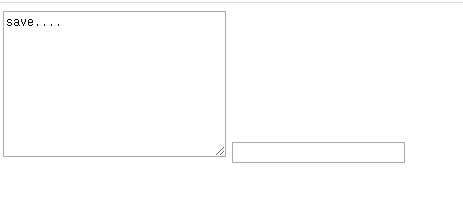
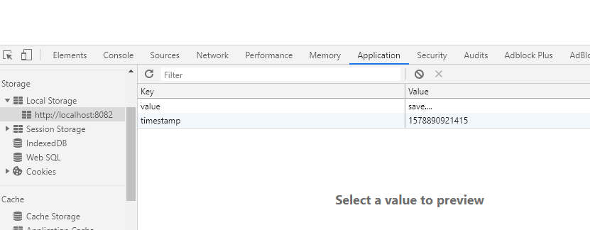
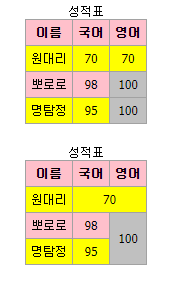
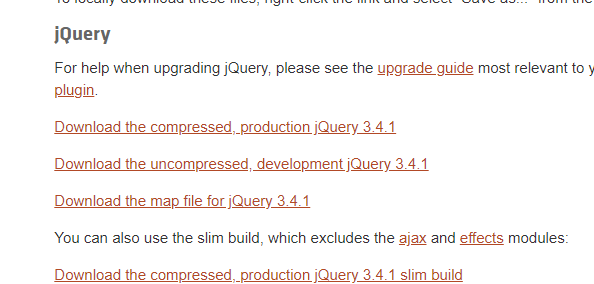
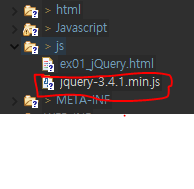
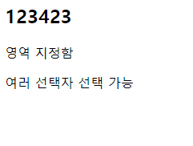
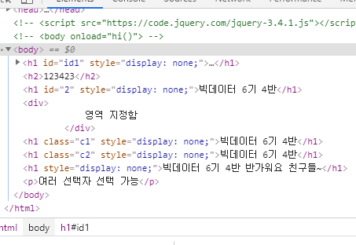

# 2020.01.13


## 자바스크립트.


배열처리

``` js
var arr3 = [
    	["a","b"]
    	["c","d"]
	] // 2차원 배열
```


자바스크립트 객체

```js
<!DOCTYPE html>
<html><head>
<meta charset="UTF-8">
<title>th147 web sample</title>

<script type="text/javascript">

/* cf) java
class Person{
	String name;
	int age;
	public void setName(Strin name){}
	public string getName(){}
}
Person p = new Person(); */


	var person = {
			name: "홍길동",
			phone: "010-9872-0202",
			addr: "서울 서대문구 연희동",
			
			info : function() { // 객체에 메소드 작성법.
				alert("name : " + this.name + "\n"
					+ "phone : " + this.phone +"\n"
					+ "addr : " + this.addr 
				);
				
				var list = '';
				for(var key in this) {
					list += (key + " : " + this[key] + "\n")
				} // for end
				
				alert(list);
			} // info end		
	};

	person.info();
</script>

</head>
<body>
	
</body>
</html>
```

결과


### ` 사용 출력

```js
function show(){
		document.write(`화면 출력 문자열 ${str}`);
	} //` 이용하면 ${}사용가능.
	

변수 var let const 사용 가능. const는 값 변경 불가능.
```


## with(this)

* this 생략하고 사용가능.

```js
var person = {
			name: "홍길동",
			phone: "010-9872-0202",
			addr: "서울 서대문구 연희동",
			
			info : function() {
				var list = '';
					
				/* list += "name : " + this.name + "\n";
				list += "phone : " + this.phone + "\n";
				list += "addr : " + this.addr  */
				
				with(this) {
					list += "name : " + name + "\n";
					list += "phone : " + phone + "\n";
					list += "addr : " + addr 
				}

				alert(list);
			} // info end		
	};

	person.info();
```

> with(this) 없을때 this. 꼭 필요함.


### === 과 ==

===는 타입도 비교한다.

==는 타입은 비교하지 않는다.

```js
var a = 1;
var b = '1';

a==b// true
a===b //false

//!=, !==도 동일.
```


### 객체에 변수 넣을때.

* push 를 이용. 배열도 마찬가지.

```js
function makePerson(name, phone, addr) {
		
		var person= {
				name : name,
				phone : phone,
				addr : addr,
				
				info : function() {
					var list = '';
					for(var key in this) {
						if( key != 'info') { // ==, === 3개짜리 권장. 2개는 타입은 비교하지 못한다.
											//3개짜리는 타입 객체 모두 비교함
							list += key + " : " + this[key] + "\n";
						}
					}// for end
					
					alert(list);
				}// info method end
		};
		
		return person;
	}

var person = [];
	person.push(makePerson("happy", "9999", "seoul"));
	person.push(makePerson("kingsmile", "8888", "busan"));
	
	for(var i in person) {
		person[i].info(); 
	}
```


### 논리 연산자.

* ! : not
* && : and
*  || : or

>  우선순위 ! > && > ||


false && true : false 앞이 false이면 뒤에 수행안함. (or에서는 앞이 true이면 더이상 수행하지 않는다.)

true && false : true


### 타입파라미터


* <> 안에는 래퍼(wrapper class) 자료형만 올수있따.

EX) 

```java
package ex01;

import java.util.ArrayList;

public class MainEntry{
    public static void main(String[] args){
        Point pt = new Point();
        System.out.println(pt);
        
        Array<Integer> list = new ArrayList();
    }
    
    
}
```

### CANVAS

```js
	
window.onload = function(){
	// Canvas DOM 객체 생성
	var canvas = document.getElementById('diagonal');
	//그리기 컨텍스트 생성
	var context = canvas.getContext('2d');

	// 선그리기 시작
	context.beginPath();
	// 시작좌표
	context.moveTo(70, 140);
	// 대각석 긋기
	context.lineTo(140, 70);

	// 선을 출력 
	context.stroke();
};
```

#### Pattern

```js
<canvas id="myCanvas" width="600" height="600"
		style="border: 1px solid #c3c3c3;"></canvas>

	<script type="text/javascript">
	window.onload = function(){
	    var canvas = document.getElementById("myCanvas");
	    var context = canvas.getContext("2d");
	 
	    var imageObj = new Image();
	    imageObj.src = "wood-pattern.png";
	    imageObj.onload = function(){
	        var pattern = context.createPattern(imageObj, 	"repeat");
	 
	        context.rect(10, 10, canvas.width - 20,  canvas.height - 20);
	 
	        context.fillStyle = pattern;
	        context.fill();
	 
	    };
	   
	};
	
	
	</script>
```

* 결과


### Drag & Drop

```js
<!DOCTYPE HTML>
<html>
	<head>
	<style type="text/css">
		#boxA, #boxB {
		   float:left;padding:10px;margin:10px;-moz-user-select:none;
		}
		#boxA { background-color: #6633FF; width:75px; height:75px;  }
		#boxB { background-color: #FF6699; width:150px; height:150px; }
	</style>
	<script type="text/javascript">
		function dragStart(ev) {
			document.getElementById("msg").innerHTML = "onDragStart->";
		   ev.dataTransfer.effectAllowed='move';
		   ev.dataTransfer.setData("Text", ev.target.id);
		   ev.dataTransfer.setDragImage(ev.target,0,0);
		   return true;
		}
		function dragEnter(ev) {
			document.getElementById("msg").innerHTML = "onDragEnter->onDragEnter->onDragEnter->onDragEnter->onDragEnter->";
		   event.preventDefault();
		   return true;
		}
		function dragOver(ev) {
			
			document.getElementById("msg").innerHTML = "onDragOver->";
			return false;
		}
		function dragDrop(ev) {
			document.getElementById("msg").innerHTML = "onDragDrop->";
		   var src = ev.dataTransfer.getData("Text");
		   ev.target.appendChild(document.getElementById(src));
		   ev.stopPropagation();
		   return false;
		}
	</script>
	</head>
	<body>
		
		<h2>Drag and drop HTML5 demo</h2>
		<div>Try to move the purple box into the pink box.</div>
		
		<div id="boxA" draggable="true" ondragstart="return dragStart(event)">
		   <p>Drag Me</p>
		</div>
		<div id="boxB" ondragenter="return dragEnter(event)" ondrop="return dragDrop(event)" 
			 ondragover="return dragOver(event)">Dustbin</div>
		<div id="msg"></div>
	</body>
</html>

```


> JQuery 를 이용하면 위와같은 노가다 코드는 필요없다. 

### WEB 로컬 Storage.

```js
<!DOCTYPE html>
<html>
<head>
<meta charset="UTF-8">
<title>웹 스토리지 테스트</title>
</head>
<body>
<textarea id="ta"></textarea>

<script type="text/javascript">
	try{
		var area = document.querySelector('#ta');
		//편집 전 컨텐츠 변경
		if ( !area.value ) {
			area.value = window.localStorage.getItem('value');
		}
		
		//컨텐츠 로컬 저장
		area.addEventListener('keyup', function(){
			window.localStorage.setItem('value', area.value);
			window.localStorage.setItem('timestamp', (new Date()).getTime() );
		}, false );
		
	}catch(ex) {
		alert("현재 브라우저는 로컬 웹스토리지를 지원하지 않습니다.");
	}
</script>

<input type="text"  >

</body>
</html>


```





* Web local Storage에 저장이 된다.


## js

### JSON

```js
<html>
	<meta charset="UTF-8">
	<head>
		<script>
		</script>
	</head>
	
	<body>
		<script>
		//----------------------------------------
		// 게시판의 데이터를 JSON 으로 표현
		//----------------------------------------
		var board = {
			"title" : "강의 자료",
			"description" : "협회[DoYeon]에서 진행중인 강의 자료 입니다.",
			"total" : 4,
			"item" : [
				{"no" : "공지", "subject" : "Javascript 강의자료", "hit" : 3, "date" : "2013.10.29"},
				{"no" : 3, "subject" : "JQuery 강의자료", "hit" : 6, "date" : "2013.11.08"},
				{"no" : 2, "subject" : "AJAX 강의자료", "hit" : 15, "date" : "2013.11.07"},
				{"no" : 1, "subject" : "Oracle 강의자료", "hit" :19, "date" : "2013.11.05"}
			]
		};
		//----------------------------------------
		// JSON으로 표현된 게시판의 데이터를 출력
		//----------------------------------------
		document.write( "게시판의 종류 => " + board.title + "<br>");
		document.write( "게시판의 설명 => " + board.description + "<br>");
		document.write( "게시판 총 글개수 => " + board.total + "<br>");
		document.write( "<table cellpadding=3 border=1>" );
		document.write( "<tr>" );
		document.write( "<td>글번호" );
		document.write( "<td>글제목" );
		document.write( "<td>조회수" );
		document.write( "<td>작성일" );
		document.write( "</tr>" );
		for ( var i=0; i<board.item.length; i++ ){
			document.write( "<tr>" );
			document.write( "<td>"+board.item[i].no );
			document.write( "<td>"+board.item[i].subject );
			document.write( "<td>"+board.item[i].hit );
			document.write( "<td>"+board.item[i].date );
		}
		document.write( "</table>" );
		</script>
	</body>
</html>
```


* {필드: value}

## jQuery

* javascript 코드를 섞어 만든 함수 Lib.

* [코드작업 사이트](https://codesandbox.io/)

* [jQuery site](https://jquery.com/)
* 개인이 만든 jQuery 존재함. custom jQuery

* API Documentation : api들 설명. [~~~] ->  생략가능한 요소.

#### jQuery 이용방법

1. file link.
2. CDN 방식.

> tip 
>
> jQuery api 이용시 body 먼저 해석해보기.

```jsp
$ : jQuery 별칭. 
```

CDN 방식

[jQuery 홈페이지](https://code.jquery.com/)

에서버전별로 골라서 스크립트에 적용

```js
<script
  src="https://code.jquery.com/jquery-3.4.1.js"></script>

	<script type="text/javascript">
  		$(document).ready(function() {
      	$('tr:even').css('backgroundColor', 'pink');
      	$('tr:odd').css('backgroundColor', 'yellow');
  	 });
	</script>
```

> 위치 중요. 위쪽에 위치해야 한다.

* 위쪽에 있을때 결과



```js
//아래쪽에 있을때

<script type="text/javascript">
  		$(document).ready(function() {
      	$('tr:even').css('backgroundColor', 'pink');
      	$('tr:odd').css('backgroundColor', 'yellow');
  	 });
	</script>
	<script
  src="https://code.jquery.com/jquery-3.4.1.js"></script>
```


* 결과


### jQuery 에서 alert 사용

```js
<script src="https://code.jquery.com/jquery-3.4.1.js"></script>
	
		<script type="text/javascript">
	
			//jQuery == $	
		
			$(document).ready(function(){
				alert('안녕');
			});
		
			
			//축약문
			
			$(function(){
				alert('안녕33333');
			});
			
			
			/*  function hi(){
				
				alert('안녕');
			}	 */ 
			
		</script>
```

## file link 방식

* 인터넷 환경이 좋지 않을 때 사용.
* jQuery 홈페이지에서 다운로드
* production , developmet 2가지 방식.
* development 는 주석이 포함되서 용량이 더 큼.
* production 용은 주석이 제거됨.(용량이 작음.)
* Download 가서 둘중 하나 클릭.




* 파일을 다운받아 작업중인 파일로 가져오기.



* 그후 스크립트 불러오기

```js


<script type="text/javascript" src = "jquery-3.4.1.min.js"></script>

// src=" jQuery 주소 " 로 추가하기.


```

* 스타일 적용 jQuery 코드

``` js
<script type="text/javascript" src = "jquery-3.4.1.min.js"></script>
		<script type="text/javascript">
	
			
			$(document).ready(function(){
				/* alert("!"); */
				$('h1').hide();
			});
</script>
	
	<!-- <body onload="hi()"> -->
	<body>
			
		<h1 id="id1">Hello
			<p>	포함된 p태그</p>
		</h1>
		<h2>123423</h2>
		<h1 id="2">빅데이터 6기 4반</h1>
		
		
		<div>
			영역 지정함
		</div>
		
		<h1 class="c1">빅데이터 6기 4반</h1>
		<h1 class="c2">빅데이터 6기 4반</h1>
		<h1>빅데이터 6기 4반 반가워요 친구들~</h1>
		<p>여러 선택자 선택 가능</p>
	
	
	</body>
```





* id, class 사용 등 여러가지 이용.

```js
$(document).ready(function(){
				// alert("!"); 
				//$('#h1').hide(); 선택자
				//$('#id1').hide(); id
				//$('.c1').hide(); class 선택
				// $('.c1').css('backgroundColor','#ffccff');
				//$('h1.c2').css('backgroundColor','#ffccff'); // 2개도 가능. 
 				// $('*').css('backgroundColor','#ffccff'); // 전체적용  
				//$('h1:first').css('backgroundColor','#ffccff'); // 첫번째 h1.
				//$('h1:last').css('backgroundColor','#ffccff'); // 마지막 h1.
				//$('h1 p').css('backgroundColor','skyblue'); //h1의 p에만 적용]
			$('h1, p, div').css('backgroundColor','skyblue'); //, 를 사용하면 모두 하나씩 적용
				
			});
```

> jQuery 문 사용시 대소문자 구분 필요함!