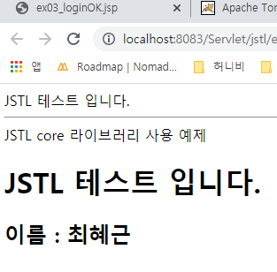

# 2020-01-17

[VScoed에서 html 실행하기](https://kkaesaem.blogspot.com/2018/06/vscode-html-chrome.html)

## JSP 

> JSP : JAVA code in HTML 

* (최신버전 2.3v)
* 혼재되어 있다. 유지보수가 힘든 단점.
* Java code 수정할때 서버를 계속 올렸다 내렸다 진행.(유지보수 단점.)
* JSP code가 섞여있는 방식을 Model 1방식이라 말함.
* Model 2방식은 MVC라고도 불리며 코드가 모두 Sevlet으로 보내진 형태임.

### JSP -> JSP로 부르기

```jsp
<%@ page language="java" contentType="text/html; charset=UTF-8"
    pageEncoding="UTF-8"%>

<!DOCTYPE html>
<html>
	<head>
		<meta charset="UTF-8">
		<title>ex03_login.jsp </title>
	</head>
	<body>
	
		<table>
			<form action="../LoginServlet"  method="post">
				<tr>
					<td>User ID : <input type="text" name="id">  </td>
				</tr>
				<tr>
					<td>User PWD : <input type="password" name="pwd">  </td>
				</tr>
				<tr>
					<td>
						Hobby:
						<input type="checkbox" name="hobby" value="baseball" >Baseball
						<input type="checkbox" name="hobby" value="soccer" >Soccer 
						<input type="checkbox" name="hobby" value="basketball" >Basketball 
					 </td>
					
				</tr>
				<tr>
					<td>
						<input type="submit"  value="Login" > 
					 </td>
				</tr>
			</form>
		</table>
	</body>
</html>
```

> 위코드는 성능적인 면에서 좋지 않음. 
>
> JSP 파일에 JSP 코드(<% %> or <%! %>)가 없다면 HTML로 작성하는 것이 더 좋음.

불려질 JSP(JSP코드는 최종적으로 Servlet 코드로 바뀐다.)

```jsp
<%@ page language="java" contentType="text/html; charset=UTF-8"
    pageEncoding="UTF-8"%>

<!DOCTYPE html>
<html>
	<head>
		<meta charset="UTF-8">
		<title>ex03_loginOK.jsp</title>
	</head>
	<body>
	
		<% 
			
		request.setCharacterEncoding("utf-8");
		String id = request.getParameter("id");	
		String pw = request.getParameter("pwd");	
		out.print(id + ", "+pw);
		%><br>
	<%= "당신의 아이디 :" + id %><br>
	<%= "당신의 Password :" + pw %><br>
	
	</body>
</html>
```


#### 데이터 여러개 가져오기.

* 인터넷으로 보낼수 있는 형식은 텍스트만 가능하다.
* 연산이 필요할 때는 텍스트를 가져와서 형변환 후 연산해야한다.

```jsp
<%@ page language="java" contentType="text/html; charset=UTF-8"
    pageEncoding="UTF-8"%>

<!DOCTYPE html>
<html>
	<head>
		<meta charset="UTF-8">
		<title>ex03_loginOK.jsp</title>
	</head>
	<body>
	
		Model 1방식
		
        <% 
			
		request.setCharacterEncoding("utf-8");
		String id = request.getParameter("id");	
		String pw = request.getParameter("pwd");	
		out.print(id + ", "+pw);
		
		//여러개의 데이터 받아오기.
		String[] hobbys = request.getParameterValues("hobby");
			
		
		%><br>
	<%= "당신의 아이디 :" + id %><br>
	<%= "당신의 Password :" + pw %><br>
	<%
		if(hobbys != null){
			for(int i=0; i<hobbys.length; i++){
				out.print(hobbys[i]+ "\t");
			}
		}
	%>
	
	</body>
</html>
```


## Servlet

> Servlet : HTML code in JAVA 

* (최신버전 4.0v)
* 유지보수하기 위해 필요함.
* html 코드를 문자열로 작성해야 하는 단점..(JSP가 생긴 이유.)
* Java code 수정할 때 서버를 내릴필요가 없다.

### 생성방법

* class 형식.

  * 반드시 httpservlet 상속 받아야함

  

* 상속 받아야 doGet(), doPost() 사용가능

* shift alt S

* 

```java
package com.sds.date;

import java.io.IOException;

import javax.servlet.ServletException;
import javax.servlet.http.HttpServlet;
import javax.servlet.http.HttpServletRequest;
import javax.servlet.http.HttpServletResponse;


public class ServletDate extends HttpServlet {

	@Override
	protected void doGet(HttpServletRequest req, HttpServletResponse resp) throws ServletException, IOException {
		// TODO Auto-generated method stub
		super.doGet(req, resp);
	}

	@Override
	protected void doPost(HttpServletRequest req, HttpServletResponse resp) throws ServletException, IOException {
		// TODO Auto-generated method stub
		super.doPost(req, resp);
	}
    
}

```

> 웹페이지는 항상 응답객체, 요청객체를 갖고 있어야 한다.

* Servlet은 반드시 <b>등록</b>이 필요하다.

* 아래 둘중 하나선택. 둘중 하나만 있어야함.

  1. 설정파일에 등록 : web.xml

     1. java EE tools 에서 Generate development descriptor Stub 선택.
     2. 소문자 권장.

     ```xml
     <?xml version="1.0" encoding="UTF-8"?>
     <web-app xmlns:xsi="http://www.w3.org/2001/XMLSchema-instance"
     	xmlns="http://java.sun.com/xml/ns/javaee"
     	xsi:schemaLocation="http://java.sun.com/xml/ns/javaee http://java.sun.com/xml/ns/javaee/web-app_3_0.xsd"
     	version="3.0">
     	<display-name>Servlet</display-name>
     	
     	<servlet>
     	
     		<servlet-name>ServletDate</servlet-name> <!-- 보통 클래스 이름사용 -->
     		<servlet-class>com.sds.date.ServletDate</servlet-class> <!-- 풀네임 찾아가는 이름 -->
     		
     	</servlet>
     	
     	<servlet-mapping>
     	
     		<servlet-name>ServletDate</servlet-name> <!-- 위와 동일하게 작성 -->
     		<url-pattern>/</url-pattern> <!-- url 뒤에 붙는 패턴.-->
     		
     	</servlet-mapping>
     	
     	
     	<!-- 가장 중요한 두가지. servlet servlet-mapping -->
     	
     	
     	<welcome-file-list> <!-- 처음 타고 들어올 관문 -->
     		<welcome-file>index.html</welcome-file>
     		<welcome-file>index.htm</welcome-file>
     		<welcome-file>index.jsp</welcome-file>
     		<welcome-file>default.html</welcome-file>
     		<welcome-file>default.htm</welcome-file>
     		<welcome-file>default.jsp</welcome-file>
     	</welcome-file-list>
     </web-app>
     ```

     

  2. 어노테이션 등록(주로사용) : 

     * @WebServlet (class안에서)

       

     * 내장객체

     * vrequest, response, out, pageContext, session, application, config, page, exception

  3. 웹에 표현하기.

  ```java
  protected void process(HttpServletRequest request, HttpServletResponse response) throws ServletException, IOException {
  		
  		//System.out.println("Hello Servlet");
  		response.setCharacterEncoding("utf-8");
  
  	}
  ```

  


* Servlet 형식

  * src 에서 Servlet 파일 생성.

  


* HTML 에서 form의 action 을 작성해야 Servlet 과 동작이 가능하다.(어노테이션을 복사해서 action tag에 추가하기.)

#### LoginServlet.java

```java
package edu.multi.kr;

import java.io.IOException;
import java.io.PrintWriter;

import javax.servlet.ServletException;
import javax.servlet.annotation.WebServlet;
import javax.servlet.http.HttpServlet;
import javax.servlet.http.HttpServletRequest;
import javax.servlet.http.HttpServletResponse;

@WebServlet("/LoginServlet")
public class LoginServlet extends HttpServlet {
	private static final long serialVersionUID = 1L;
       
    public LoginServlet() {
        super();
    }

	protected void doGet(HttpServletRequest request, HttpServletResponse response) throws ServletException, IOException {

		response.setCharacterEncoding("EUC-KR");
		String id = request.getParameter("id");
		String pwd = request.getParameter("pwd");
		System.out.println(id + "," +pwd);
		PrintWriter pw = response.getWriter();
		
		pw.write("<html><head><title>ID확인</title></head>");
		pw.write("<body><h1>정보.</h1><hr>");
		pw.write("<h2>ID :");
		pw.write(id);
		pw.write("<br>pw :");
		pw.write(pwd);
		pw.write(" 입니다.</h2>");
		pw.write("<a href='html/loginForm.html'>Login</a>");
		pw.write("</body></html>");
		pw.close();
	}

	protected void doPost(HttpServletRequest request, HttpServletResponse response) throws ServletException, IOException {
		// TODO Auto-generated method stub
		doGet(request, response);
	}

}

```

#### loginForm.html

```html
<!DOCTYPE html>
<html><head>
<meta charset="UTF-8">
<title>Login Form</title>
<script type="text/javascript" src="../js/jscript.js"></script>
</head>
<body>
<h1>Login HTML</h1>

<hr>
<table>
	<form action="../LoginServlet"  method="post">
		<tr>
			<td>User ID : <input type="text" name="id">  </td>
		</tr>
		<tr>
			<td>User PWD : <input type="password" name="pwd">  </td>
		</tr>
		<tr>
			<td>
				<input type="submit"  value="전송" > 
				<input type="reset"  value="취소"> 
			 </td>
		</tr>
	</form>
</table>
</body>
</html>
```

#### 결과

1. 

2.	


### DB연동

1. DB class 생성


```java
package edu.db.custom;

public class Customer {
	
	private int code;
	private String name,email,phone;
	
	public int getCode() {
		return code;
	}
	public void setCode(int code) {
		this.code = code;
	}
	public String getName() {
		return name;
	}
	public void setName(String name) {
		this.name = name;
	}
	public String getEmail() {
		return email;
	}
	public void setEmail(String email) {
		this.email = email;
	}
	public String getPhone() {
		return phone;
	}
	public void setPhone(String phone) {
		this.phone = phone;
	}
	@Override
	public String toString() {
		return "Customer [code=" + code + ", name=" + name + ", email=" + email + ", phone=" + phone + "]";
	}
}
```

### XML 파일 셋팅

- xml 파일에 아래 코드를 추가.

```xml
<resource-ref>
      <description>Connection</description>
      <res-ref-name>jdbc/OracleDB</res-ref-name>
      <res-type>javax.sql.DataSource</res-type>
      <res-auth>Container</res-auth>
</resource-ref>
```


### JSP 이용

- JSP 파일을 이용하여 JAVA code를 통해 DB를 연동하여 사용.

```jsp
<%
Connection conn=null;
String driver = "oracle.jdbc.driver.OracleDriver";
String url = "jdbc:oracle:thin:@localhost:1521:XE";
	
Boolean connect = false;
	
try{
    Class.forName(driver);
    conn=DriverManager.getConnection(url,"hr2","1234"); //자신의 아이디와 비밀번호
    connect = true;
    conn.close();
}catch(Exception e){
    connect = false;
    e.printStackTrace();
}
%>
<%
if(connect==true)else{ %>
    연결에 실패하였습니다.
<%}%> 
```


## JSTL

JSTL(JSP Standard Tag Library) jar 파일이 필요함!

2개의 library 필요함.

아래 두 파일을 WEB-INF lib 에 추가하여야 JSTL 사용 가능함.

[JSTL Download](https://mvnrepository.com/artifact/javax.servlet/jstl/1.2)

[standard](https://mvnrepository.com/artifact/taglibs/standard/1.1.2)

---


가끔 환경에 따라 오류가 뜰 때. _rf

---

JSTL 예제.

```jsp
<%@ page language="java" contentType="text/html; charset=UTF-8"
    pageEncoding="UTF-8"%>
<%@taglib prefix="c" uri="http://java.sun.com/jsp/jstl/core"%>
<!DOCTYPE html>
<html>
	<head>
		<meta charset="UTF-8">
		<title></title>
	</head>
	<body>
		<%
			//java code - jsp
			String str = "JSTL 테스트 입니다.";
			out.print(str);
		%><hr>
		
		JSTL core 라이브러리 사용 예제
		<br>
		<c:set var = "msg" value = "JSTL 테스트 입니다."/>
		<h1><c:out value="${msg}"/></h1>
		
		<c:set  value="최혜근" var = "name"/> 
		<h2>이름 : <c:out value="${name}"/></h2>
		
		<c:set var = "num">1000</c:set>
		<c:out value="${num}"/><font color="red">원</font>
		<hr>
		
		<c:catch var="error">
			<%=10/0 %>
		</c:catch>
		
		<h3>&lt;c:catch&gt; 로 잡아낸 오류: <c:out value="${error}"/></h3>
				
	</body>
</html>
```

- 결과




## login 창 만들기.

### 방법.

* (만든곳) -> (실행한곳)

* Servlet -> Servlet
* html -> Servlet
* JSTL -> Servlet

## 위치

- 
- 
- 

