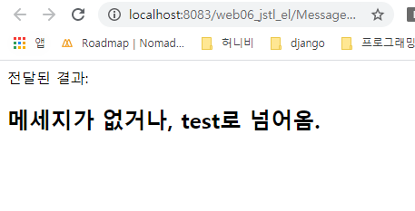
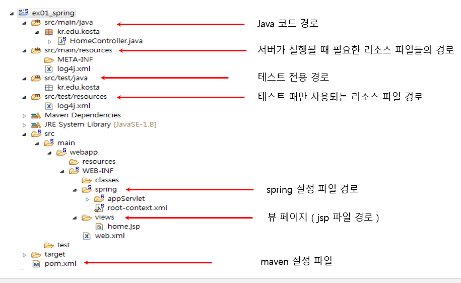

# 2020-01-21

## DB없이 MVC 만들기.

* controller와 model은 src에 저장( .java )
* view는 WebContent에 저장. ( .html or .jsp )  
* 실행은 Controller에서 실행한다.

### Controller

* model 과 view를 연결해주는 역할

```java
package com.multi.controller;

import java.io.IOException;

import javax.servlet.RequestDispatcher;
import javax.servlet.ServletException;
import javax.servlet.annotation.WebServlet;
import javax.servlet.http.HttpServlet;
import javax.servlet.http.HttpServletRequest;
import javax.servlet.http.HttpServletResponse;

@WebServlet("/MessageController")
public class MessageController extends HttpServlet {
	private static final long serialVersionUID = 1L;
       
	//1. 전송방식 결정 ,사용자 요청 분석(doGet/doPost)
	protected void doGet(HttpServletRequest request, HttpServletResponse response) throws ServletException, IOException {
		process(request, response);
	}

	protected void doPost(HttpServletRequest request, HttpServletResponse response) throws ServletException, IOException {
		process(request, response);
	}
	
	//2. 사용자 요청 처리 메세지(doGet / doPost 방식)
	protected void process(HttpServletRequest request, HttpServletResponse response) throws ServletException, IOException {
		
		String msg = request.getParameter("message");
		Object result =null;
		
		if(msg == null||msg.equals("test")){
			result = "메세지가 없거나, test로 넘어옴. ";
		}else if(msg.equals("name")){
			result = "내 이름은 kinsmile.";
		}else {
			result = "찾는 type이 없음.";
		}// if end
		
		//3. 데이터 저장
		request.setAttribute("result", result); // spring도 유사함.
		
		//4. 해당 view page 이동 : WebContent/view/~~~.jsp
		RequestDispatcher disp = request.getRequestDispatcher("/view/msgView.jsp");
		disp.forward(request, response);
	}

}

```

### View

```jsp
<%@ page language="java" contentType="text/html; charset=UTF-8"
    pageEncoding="UTF-8"%>
<%@taglib prefix="c" uri="http://java.sun.com/jsp/jstl/core" %>

<!DOCTYPE html>
<html>
	<head>
		<meta charset="UTF-8">
		<title>msgView.jsp</title>	
	</head>
	<body>
		전달된 결과:
		<h2><c:out value="${result}"></c:out></h2>
	
	</body>
</html>
```

결과



### 실습] PersonInfo 서블릿 페이지에 사람들의 이름.주소.연락처 저장, info.jsp 에서 출력하기. MVC형태로.

* PersonInfo

```java
package com.multi.controller;

import java.io.IOException;

import javax.servlet.RequestDispatcher;
import javax.servlet.ServletException;
import javax.servlet.annotation.WebServlet;
import javax.servlet.http.HttpServlet;
import javax.servlet.http.HttpServletRequest;
import javax.servlet.http.HttpServletResponse;

/**
 * Servlet implementation class PersonInfo
 */
@WebServlet("/PersonInfo")
public class PersonInfo extends HttpServlet {
	private static final long serialVersionUID = 1L;

	protected void doGet(HttpServletRequest request, HttpServletResponse response) throws ServletException, IOException {
		doProcess(request, response);
		}

	protected void doPost(HttpServletRequest request, HttpServletResponse response) throws ServletException, IOException {
		// TODO Auto-generated method stub
		doProcess(request, response);
	}
	
	protected void doProcess(HttpServletRequest request, HttpServletResponse response) throws ServletException, IOException {
		String name = request.getParameter("name");
		String address = request.getParameter("address");
		String phone = request.getParameter("phone");
				
		Person person = new Person(name, address, phone);
		
		request.setAttribute("person1", person);
		
		RequestDispatcher dispathcer = request.getRequestDispatcher("/view/info.jsp");
		dispathcer.forward(request, response);
		
	}
	
	class Person{
		
		String name;
		String address;
		String phone;
		
		public Person(String name, String address, String phone) {
			super();
			this.name = name;
			this.address = address;
			this.phone = phone;
		}

		@Override
		public String toString() {
			return "이름은 " + name + ", 주소는 " + address + ", 핸드폰 번호는 " + phone;
		}
		
		
		
	}

}

```

* index.html

```html
<!DOCTYPE html>
<html lang="ko">
  <head>
    <meta charset="UTF-8" />
    <meta name="viewport" content="width=device-width, initial-scale=1.0" />
    <meta http-equiv="X-UA-Compatible" content="ie=edge" />
<!--    <link rel="stylesheet" href="./style.css" />-->
    <title>The Web HTML CSS JS jQuery</title>
  </head>
  <body>
  	<form action="PersonInfo">
		이름:&nbsp;<input type="text" name="name" placeholder="이름"><br>
		주소:&nbsp;<input type="text" name="address" placeholder="주소"><br>
		번호:&nbsp;<input type="text" name="phone" placeholder="폰번호"><br>
		<input type="submit" value="입력"> &nbsp;<input type="reset" value="취소">
	</form>
  </body>
</html>
```

* inpo.jsp

```jsp
<%@ page language="java" contentType="text/html; charset=UTF-8"
	pageEncoding="UTF-8"%>
<%@taglib prefix="c" uri="http://java.sun.com/jsp/jstl/core"%>
<!DOCTYPE html>
<html>
<head>
<meta charset="UTF-8">
<title>info.jsp</title>
</head>
<body>
	<p>
		전달된 사람은 : <c:out value="${person1}"></c:out> 입니다.
	</p>
</body>
</html>
```

## Spring Framewor

* Eclipse와 Spring IDE .metadata 충돌될수도있음. workspace 따로잡기.
* .m2 -> maven 기반.

### Maven : 프로젝트 관리.

* Spring 어원 : EJB보다 경량이다..... EJB가 겨울이라면 Spring..

### Spring..

* 보통의 framework. 내가만든 코드에 들어와 도움을줌.
* Spring은 내가만든 코드가 프레임워크에 의해 끼워 들어가 제어됨.
* 제어의 역전. (IoC)

Tool Suite : 4 

Framework : 5

### Spring Legacy Project

* marketPlace에서 sts 3 add-on for Spring Tools 4 설치해야 사용가능.
* 실제 프로젝트는 Spring MVC Project로 진행함.
* 구조를 알아서 만들어줌. 이 구조를 만들어 주는것이 Maven.
* 프로젝트 만들때 패키지를 반드시 3단까지 가야함. 사이트 주소 거꾸로 쓰는것이 정석(xxx. ArticleId. GroupId)


* 생성시 시간이 좀 걸리면서 Library 다운로드 진행함.
* 저장장소 : C:\Users\student\.m2\repository 

@Controller : controller 역할 부여하는 어노테이션.

```java
package kr.sds.edu;

import java.text.DateFormat;
import java.util.Date;
import java.util.Locale;

import org.slf4j.Logger;
import org.slf4j.LoggerFactory;
import org.springframework.stereotype.Controller;
import org.springframework.ui.Model;
import org.springframework.web.bind.annotation.RequestMapping;
import org.springframework.web.bind.annotation.RequestMethod;

/**
 * Handles requests for the application home page.
 */
@Controller
public class HomeController {
	
	private static final Logger logger = LoggerFactory.getLogger(HomeController.class);
	
	/**
	 * Simply selects the home view to render by returning its name.
	 */
	@RequestMapping(value = "/", method = RequestMethod.GET)
	public String home(Locale locale, Model model) {
		logger.info("Welcome home! The client locale is {}.", locale);
		
		Date date = new Date();
		DateFormat dateFormat = DateFormat.getDateTimeInstance(DateFormat.LONG, DateFormat.LONG, locale);
		
		String formattedDate = dateFormat.format(date);
		
		model.addAttribute("serverTime", formattedDate );
		
		return "home"; // home.jsp로 이동하는 의미. /WEB-INF/views/ + hmoe + .jsp Spring FrmaeWork가 왼쪽처럼 완성시킴.
	}
	
}

```

*  Source 구조.
* main 2개 test 2개
* 주 Source는 main 폴더 안으로.



* junit 으로 test 가능. [참고도서](http://www.yes24.com/Product/Goods/64340061)