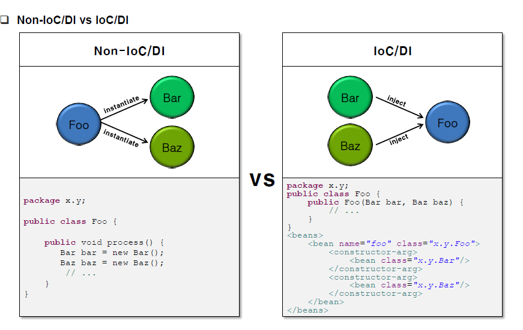
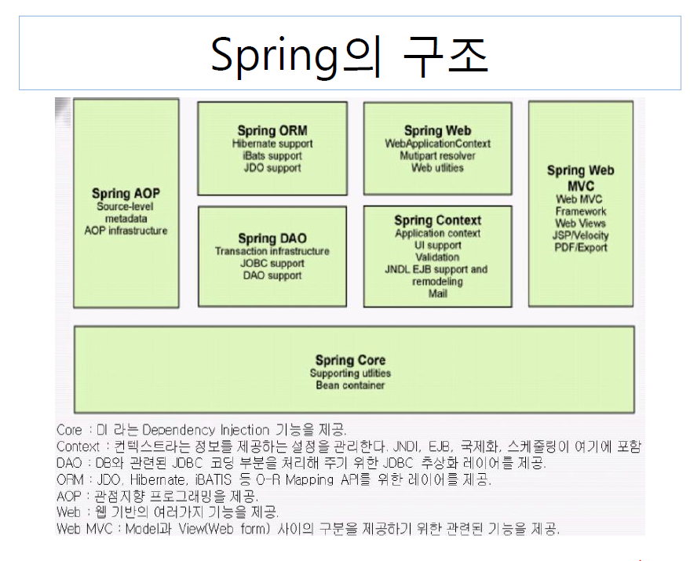

# 2020-01-23

## FrameWork

* Library 집합. (Library 예시. jQuery)
* Spring FrameWork
  * Web & Application 개발에 경계가 없다.(둘다 사용 가능.)
  * 타 프레임워크들과 호환성 좋음. (다른언어로도 사용가능)
  * 모바일도 사용가능.
* .net : MS에서 개발한 FrameWork

## Maven 

* 프로젝트 관리 도구.

* 아래 모두 프로잭트 관리도구들.

  

  > Gradle : Dalvik의 프로젝트 관리 도구. ; Groovy 언어


## DI

* 코드수정 : 외부에서 넣기.
* 각각의 계층이나 서비스들 간에 의존성이 존재할 경우 프레임워크가 서로 연결시켜준다.




### pom.xml 을 이용하여 Lib넣는 방법.

* 이 방법으로 진행시 local repository (.M2)에 저장이됨.
* 이 방법 이외에 Lib를 직접 넣을수도 있으나 용량을 많이 차지하게됨.
* java project를 오른쪽 클릭후 Configure에서 convert Maven~~~ 선택하면 pom.xml이 생성됨.

* 라이브러리 종류



[Maven 사이트](https://mvnrepository.com/)에서 Spring-context 검색. 보편적인 버전 v.4 ( 4.1.7)

* pom.xml 에 복사한 코드 추가.

* In pom.xml

```xml
<dependencies>
		<!-- https://mvnrepository.com/artifact/org.springframework/spring-context -->
		<dependency>
			<groupId>org.springframework</groupId>
			<artifactId>spring-context</artifactId>
			<version>4.1.7.RELEASE</version>
		</dependency>
</dependencies>
```

> .xml에 plugins tag가 있으면 dependencies tag를 사용하지 않으면 오류가 생김. 

### bean을 이용한 객체생성.

* IoC Container
  * BeanFactory
    * BeanFactory 인터페이스는 Spring IoC Container의 기능을 정의하고 있는 기본 인터페이스이다.
    * Bean 생성 및 의존성 주입, 생명주기 관리 등의 기능을 제공한다.
  * ApplicationContext
    * BeanFactory 인터페이스를 상속받는 ApplicationContext는 BeanFactory가 제공하는 기능 외에 Spring AOP, 메시지 리소스 처리(국제화에 사용됨), 이벤트 처리 등의 기능을 제공한다.
    * 모든 ApplicationContext 구현체는 BeanFactory의 기능을 모두 제공하므로, 특별한 경우를 제외하고는 ApplicationContext를 사용하는 것이 바람직하다.

* Spring bean Configuration File 을 작성. java에서 new를 통해 만드는 것과 같은 의미. 메모리에 적재.

```xml
<?xml version="1.0" encoding="UTF-8"?>
<beans xmlns="http://www.springframework.org/schema/beans"
	xmlns:xsi="http://www.w3.org/2001/XMLSchema-instance"
	xsi:schemaLocation="http://www.springframework.org/schema/beans http://www.springframework.org/schema/beans/spring-beans.xsd">

	<!--  applicationCtx.xml -->
	<bean id = "en" class ="di3.MessageBeanimpEn" ></bean>
	<bean id = "kr" class="di3.MessageBeanimpKor"></bean>
	<!-- java : new spring = bean -->
	
</beans>
```

* Main문에서 사용.

```java
package di3;

import org.springframework.context.ApplicationContext;
import org.springframework.context.support.ClassPathXmlApplicationContext;

public class Msgmain {

	public static void main(String[] args) {
		
		ApplicationContext ctx = new ClassPathXmlApplicationContext("di3/applicationCtx.xml"); // spring 컨테이너 생성함.
		
		MessageBean bean = ctx.getBean("en", MessageBean.class); //형변환 하지않고 인자 입력("bean객체명", "해당 클래스명")
		bean.Message("Spring");
		
		bean = (MessageBean)ctx.getBean("kr"); // 형변환을 통한 입력.
		bean.Message("Spring");
		
		
 	}

}

```

* 결과


* name으로도 가능.(class 도 가능.)


```java
public static void main(String[] args) {
	
	ApplicationContext ctx = new ClassPathXmlApplicationContext("di3/applicationCtx.xml"); // spring 컨테이너 생성함.
	
	MessageBean bean = ctx.getBean("m2", MessageBean.class);  //bean 파일에서 name='m2' 객체를 가져옴
	bean.Message("Spring~");
	
	bean = (MessageBean)ctx.getBean("kr");
	bean.Message("Spring");
```
* 방법
  * 생성자함수(constructor)

  * 셋터메소드(setter) : 더 많이 이용함.(권장)

  

* 자바에서 객체생성 : new

* spring에서 객체생성 : <bean>

### DI constructor.

* xml 값에 <constructor-arg> 이용

```xml
<!-- 1.생성자함수 이용하기 -->
<bean id = "record" class ="di4.ScoreImp" >
		<constructor-arg name="kor" value="90"/>
		<constructor-arg name="eng" value="90"/>
		<constructor-arg name="math" value="90"/>
</bean>
<bean id = "show" class="di4.ScoreShowImp">
		<constructor-arg name="record" ref="record"/>
</bean>
```

* name : 맴버 필드의 이름.
* ref = 참조 객체.

DI setter

* <property>이용

```xml
	<bean id="record" class="di4.ScoreImp">
		<property name="kor" value="88" />
		<property name="eng" value="88" />
		<property name="math" value="88" />
	</bean>


	<bean id="show" class="di4.ScoreShowImp">
		<property name="record" ref="record" />
	</bean>
```


## AOP

* 스프링은 [관점 지향 프로그래밍](https://ko.wikipedia.org/wiki/관점_지향_프로그래밍)(AOP : Aspect-Oriented Programming)을 지원한다.
* 따라서 [트랜잭션](https://ko.wikipedia.org/wiki/트랜잭션)이나 로깅, 보안과 같이 여러 모듈에서 공통적으로 사용하는 기능의 경우 해당 기능을 분리하여 관리할 수 있다.
* 객체지향을 더 보조해주는 개념.


> 프로그램 품질관리 7단계
>
> 응집도는 높게 결합도는 낮게.
>
> 응집도 :  프로그램의 한 요소가 해당 기능을 수행하기 위해 얼마만큼의 연관된 책임과 아이디어가 뭉쳐있는지를 나타내는 정도이다. 일반적으로 프로글매의 한 요소가 특정목적을 위해 밀접하게 연관된 기능들이 모여서 구현되어 있고, 지나치게 많은 일을 하지 않으면 그것을 응집도가 높다고 표현한다. 응집도가 높으면 프로그램을 쉽게 이해할 수 있으므로 유지보수성이 높아진다.
>
> 결합도 :  스프트웨어 코드의 한 요소가 다른 것과 얼마나 강력하게 연결되어 있는지 , 또한 얼마나 의존적인지 나타내는 정도. 프로그램의 요소가 결합도가 낮다는 것은 그것이 다른 요소들과 관계를 그다지 맺지 않은 상태를 의미한다.
>
> 결합도를 낮추는 법 : 인터페이스 사용.

* * 
* 